# 👨‍💻 **Aziz Ruri Suparman**
## *Senior Backend Engineer • Performance Optimization Specialist • 87% Faster Systems*

 

---

## 🎯 **Executive Summary • Why Hire Me?**

<table style="border: none;">
<tr>
<td align="center" width="20%" style="border: none;">

### **⚡ 87%**
**Performance Gains**  
*15+ seconds → <2 seconds*  
Search optimization expert

</td>
<td align="center" width="20%" style="border: none;">

### **🚀 500%**
**Capacity Increase**  
*100 → 500+ applications/month*  
Scalable architecture specialist

</td>
<td align="center" width="20%" style="border: none;">

### **🏦 8**
**Major Projects**  
*Banking • Government • Automotive*  
Cross-industry expertise

</td>
<td align="center" width="20%" style="border: none;">

### **💰 5+**
**Years Experience**  
*Real-time systems • Event-driven*  
Production-ready solutions

</td>
<td align="center" width="20%" style="border: none;">

### **📞 Ready**
**To Interview**  
*Available immediately*  
[**📧 Contact Now**](mailto:me@ruriazz.com)

</td>
</tr>
</table>

---

> **"I don't just write code—I architect solutions that transform businesses and delight users"**

**Senior Backend Engineer** with 5+ years of experience delivering **measurable impact** across fintech, automotive, and government sectors. I specialize in **high-performance systems**, **real-time architectures**, and **scalable solutions** that drive business growth.

**🎯 Value Proposition:** Transform complex technical challenges into elegant, profitable solutions with proven ROI.

### **🔥 Immediate Impact Areas**

---

---

## 📊 **Performance Metrics That Matter**

```mermaid
graph LR
    A["🔍 Search Performance"] 
    B["15+ seconds"] 
    C["< 2 seconds"]
    A --> B
    B --> C
    
    style A fill:#e3f2fd
    style B fill:#ffebee
    style C fill:#e8f5e8
```

<table>
<tr>
<td width="50%" valign="top">

**Search Optimization Impact**
- **87% performance improvement**
- **Otoklix customer app search**
- **Elasticsearch architecture redesign**

```mermaid
graph LR
    D["🏛️ Government Capacity"] 
    E["100 apps/month"] 
    F["500+ apps/month"]
    D --> E
    E --> F
    
    style D fill:#e3f2fd
    style E fill:#ffebee
    style F fill:#e8f5e8
```

</td>
<td width="50%" valign="top">

**Scalability Achievement**
- **500% capacity increase**
- **Government digital transformation**
- **Redis optimization & automation**

</td>
</tr>
</table>

---

## � **What Makes Me Different**

<table>
<tr>
<td align="center" width="25%">

**⚡ Performance Focus**  
*87% faster systems*  
Sub-second response times  
500% capacity improvements

</td>
<td align="center" width="25%">

**🏗️ Architecture Excellence**  
*Event-driven design*  
Real-time communication  
Scalable microservices

</td>
<td align="center" width="25%">

**🎯 Business Impact**  
*Measurable results*  
Cost-effective solutions  
User experience optimization

</td>
<td align="center" width="25%">

**🤝 Versatile Expertise**  
*Cross-industry experience*  
Government to fintech  
Startup to enterprise

</td>
</tr>
</table>

---

## 📋 **Portfolio Navigation**

*Quick access to what matters most to you*

**🚀 [Schedule Interview Call](mailto:me@ruriazz.com?subject=Interview%20Opportunity%20-%20Backend%20Engineer&body=Hi%20Aziz,%0A%0AI%20reviewed%20your%20portfolio%20and%20would%20like%20to%20discuss%20a%20Backend%20Engineer%20opportunity.%0A%0ACompany:%20%0ARole:%20%0APreferred%20contact%20method:%20%0A%0ALooking%20forward%20to%20connecting!)**

| Section | What You'll Find | Why It Matters | Direct Access |
|---------|------------------|----------------|---------------|
| 🎯 **[Featured Projects](./projects/README.md)** | 8 flagship projects with ROI metrics | See measurable business impact | [📊 View Impact](./projects/README.md) |
| 💼 **[Professional Experience](./experience/README.md)** | 5+ years across Banking, Government, Automotive | Understand versatility & growth | [📈 See Progression](./experience/README.md) |
| 🛠️ **[Technical Skills](./skills/README.md)** | Production-ready technology expertise | Evaluate technical fit | [⚡ Check Skills](./skills/README.md) |
| 📞 **Contact** | Direct communication channels | Start the conversation | [📧 Email Now](mailto:me@ruriazz.com) |

---

## 🎯 **Featured Project Highlights**

*Real projects that delivered transformational business impact*

### 🏦 **[SMBC Video Call Auto-Assignment System](./projects/smbc-video-call-system.md)**
**Banking Revolution Through Real-time Architecture • ROI: Eliminated server overhead + Enhanced CS efficiency**

**🎯 Challenge:** Inefficient polling system causing server load  
**⚡ Solution:** Redis Stream + WebSocket real-time architecture  
**📊 Impact:** Eliminated overhead, priority assignments, enhanced efficiency  
**🔗 [View Technical Deep-Dive](./projects/smbc-video-call-system.md)**

---

### 🏗️ **[BTB-Ku Dam Management Platform](./projects/btb-ku-dam-management.md)**
**Government Digital Transformation • ROI: 500% capacity increase + 70% time reduction**

**🎯 Challenge:** Manual permit processes across Ministry of Public Works  
**⚡ Solution:** Integrated digital platform with Redis caching + background processing  
**📊 Impact:** 70% faster processing, 500% capacity increase, enhanced transparency  
**🔗 [View Government Impact](./projects/btb-ku-dam-management.md)**

---

### 🔍 **[Intelligent Similarity Search System](./projects/intelligent-similarity-search.md)**
**AI-Powered Search Revolution • ROI: 85% accuracy improvement + CS productivity boost**

**🎯 Challenge:** ERP search limited to exact matches, frustrated CS teams  
**⚡ Solution:** Multi-algorithm similarity (Cosine, Jaccard, Fuzzy, Spell-check)  
**📊 Impact:** 85% search accuracy improvement, enhanced CS productivity  
**🔗 [View AI Implementation](./projects/intelligent-similarity-search.md)**

---

### 🛒 **[Otoklix Search Engine Optimization](./projects/otoklix-search-optimization.md)**
**Performance Engineering Masterclass • ROI: 87% speed improvement + Enhanced UX**

**🎯 Challenge:** Customer app search taking 15+ seconds with poor relevance  
**⚡ Solution:** Complete Elasticsearch architecture redesign from MySQL dependency  
**📊 Impact:** **87% performance improvement**, enhanced user satisfaction  
**🔗 [View Performance Case Study](./projects/otoklix-search-optimization.md)**

### **🚀 Ready to Discuss Your Next Project?**

---

## �️ **Technology Excellence**

### **Production-Ready Tech Stack**

<table>
<tr>
<td width="25%">

**🚀 Backend Frameworks**

</td>
<td width="25%">

**⚡ Performance & Caching**

</td>
<td width="25%">

**🔄 Real-time & Communication**

</td>
<td width="25%">

**🏗️ Infrastructure & DevOps**

</td>
</tr>
</table>

### **💡 Core Engineering Principles**

- **🎯 Performance-First Design** - Building fast systems from the ground up, not as an afterthought
- **🏗️ Scalable Architecture** - Event-driven, microservices-ready solutions that grow with business
- **🔒 Security by Design** - Authentication, validation, and error handling built into every layer
- **📊 Data-Driven Decisions** - Comprehensive monitoring and metrics for continuous optimization
- **🤝 Team Collaboration** - Clear documentation and knowledge sharing for sustainable growth

---

## 📈 **Proven Track Record**

### **Career Highlights & Business Impact**

<table>
<tr>
<td align="center" width="33%">

**⚡ Performance Engineering**  
**87%** search performance improvement  
**500%** system capacity increase  
**Sub-second** response times achieved

</td>
<td align="center" width="33%">

**🏗️ System Architecture**  
**Event-driven** real-time systems  
**Microservices** & scalable design  
**Full-stack** infrastructure management

</td>
<td align="center" width="33%">

**🎯 Business Transformation**  
**70%** reduction in processing times  
**Government** digitalization projects  
**Cross-industry** expertise proven

</td>
</tr>
</table>

### **💼 Professional Journey**

---

## � **Ready to Transform Your Backend Systems?**

*Let's discuss how I can help accelerate your next project*

 

### **What You Get When You Hire Me**

<table>
<tr>
<td align="center" width="20%">

**⚡ Immediate Impact**  
Hit the ground running  
with proven expertise  
and deep technical skills

</td>
<td align="center" width="20%">

**📈 Performance Focus**  
Optimize existing systems  
for maximum efficiency  
and measurable improvements

</td>
<td align="center" width="20%">

**🏗️ Scalable Solutions**  
Build for growth with  
future-proof architecture  
and best practices

</td>
<td align="center" width="20%">

**🤝 Team Leadership**  
Mentor developers and  
share knowledge effectively  
across your organization

</td>
<td align="center" width="20%">

**🎯 Business Value**  
Focus on solutions that  
drive real business impact  
and user satisfaction

</td>
</tr>
</table>

 

### **💼 I'm Currently Open For**

<table>
<tr>
<td align="center" width="33%">

**🚀 Senior Backend Engineer**  
Lead complex backend projects  
Architect scalable systems  
Mentor development teams

</td>
<td align="center" width="33%">

**🏗️ System Architect**  
Design enterprise solutions  
Performance optimization  
Technology strategy planning

</td>
<td align="center" width="33%">

**👨‍💻 Technical Lead**  
Team leadership and guidance  
Cross-functional collaboration  
Technical decision making

</td>
</tr>
</table>

 

### **📞 Let's Connect - Multiple Ways to Reach Me**

<table>
<tr>
<td align="center" width="33%">

**For direct communication**  
Response within 24 hours guaranteed

</td>
<td align="center" width="33%">

**Professional networking**  
Connect and view recommendations

</td>
<td align="center" width="33%">

**Code samples & projects**  
See my work in action

</td>
</tr>
</table>

 

### **🌟 What Makes Working With Me Different**

*"I don't just deliver code—I deliver solutions that transform your business"*

<table>
<tr>
<td align="center" width="25%">

**🎯 Results-Oriented**  
Every project includes measurable  
performance improvements and  
clear business value metrics

</td>
<td align="center" width="25%">

**📚 Knowledge Sharing**  
I document everything and  
train your team to maintain  
and extend solutions

</td>
<td align="center" width="25%">

**⚡ Modern Approach**  
Use latest technologies and  
best practices to ensure your  
systems stay competitive

</td>
<td align="center" width="25%">

**🤝 Collaborative Style**  
Work closely with your team,  
respect existing processes,  
and enhance what works

</td>
</tr>
</table>

 

### **📍 Work Arrangement & Availability**

**🌍 Location:** Jakarta, Indonesia (Open to global remote opportunities)  
**⏰ Availability:** Full-time, contract, or consulting arrangements  
**🕐 Time Zone:** GMT+7 (Flexible for global collaboration)  
**💼 Work Style:** Remote-friendly, agile, results-focused  

**🚀 Ready to Start:** Immediate availability for the right opportunity

---

### **🎯 Quick Response Promise**

**Email me at [me@ruriazz.com](mailto:me@ruriazz.com) and you'll get:**

✅ **Response within 24 hours** for interesting opportunities  
✅ **Technical discussion** about your specific challenges  
✅ **Portfolio walkthrough** relevant to your needs  
✅ **References and recommendations** from previous clients  

 

### **📞 Connect With Me**

 

**� Quick Response Promise:** Interesting opportunities get a response within 24 hours  
**🌍 Work Style:** Remote-friendly, collaborative, results-oriented  
**� Location:** Jakarta, Indonesia (Open to global remote opportunities)

---

## 🗂️ Portfolio Navigation

| 📂 **Detailed Sections** |
|:------------------------:|
| **[🎯 View All Projects](./projects/README.md)** - Complete project portfolio with technical details |
| **[💼 Professional Experience](./experience/README.md)** - Career journey and achievements |
| **[🛠️ Technical Skills](./skills/README.md)** - Comprehensive technical expertise breakdown |

---

*"The best backend is the one users never have to think about—it just works, fast and reliably."*
