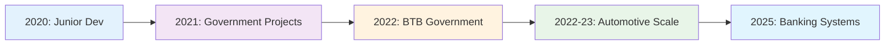
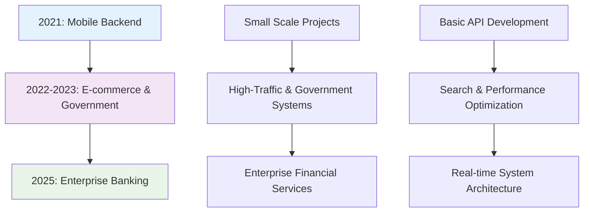

# 💼 Professional Experience
> **5+ Years Building Scalable Systems • Banking → Government → Automotive → Fintech**

## **🚀 Career Growth Trajectory**

**Career Evolution:** Junior Developer → Cross-Industry Specialist → Senior Performance Engineer  
**Key Growth:** Technical complexity + Business impact + Leadership responsibilities

---

### **📊 Career Impact Summary**

| Metric | Achievement | Industry | Year |
|--------|------------|----------|------|
| **Performance** | 87% improvement | Automotive | 2022-23 |
| **Capacity** | 500% increase | Government | 2022-23 |
| **Efficiency** | 70% time reduction | Public Service | 2021 |
| **Innovation** | Real-time architecture | Banking | 2025 |

---

## 🏦 SMBC Indonesia
**Fullstack Engineer** | *May 2025 - July 2025*

### 🎯 Project Focus
Contributed to the digital transformation of **SMBC Indonesia** (Sumitomo Mitsui Banking Corporation Indonesia) by developing and optimizing an auto-assignment system for video call services used across multiple channels, including the premium **Sinaya Prioritas** service.

### 🛠️ Technical Responsibilities
- **System Optimization**: Transformed polling-based video call assignment to event-driven architecture
- **Real-time Implementation**: Integrated Redis Stream/Sorted Set with WebSocket for instant notifications
- **Performance Enhancement**: Eliminated API polling overhead and improved system responsiveness
- **Architecture Migration**: Successfully migrated from Redis Stream to Sorted Set + Hash + Pub/Sub

### 📊 Key Achievements
- ✅ Eliminated server load from repetitive API polling
- ✅ Implemented priority-based call assignment following business rules
- ✅ Enhanced agent and customer experience with real-time updates
- ✅ Built scalable event-driven architecture for future growth

### 🔧 Technology Stack
- **Backend**: Internal framework (project-specific)
- **Real-time**: Redis (Stream, Sorted Set, Hash, Pub/Sub), WebSocket
- **Architecture**: Event-driven, microservices-oriented

---

## 🚗 Otoklix Indonesia
**Backend Engineer** | *March 2022 - December 2023*

### 🎯 Company Overview
Otoklix is a leading B2C digital platform in Indonesia's automotive sector, providing comprehensive services for vehicle maintenance, parts, and workshop management.

### 🛠️ Major Projects & Contributions

#### **Search Engine Optimization Project** *(Aug 2022 - Nov 2022)*
- **Challenge**: Customer app search taking 15+ seconds with poor relevance
- **Solution**: Redesigned from package-based to product-based search using Elasticsearch
- **Impact**: **87% performance improvement** (15+ seconds → <2 seconds)
- **Technical**: Elasticsearch optimization, reduced MySQL dependency, RabbitMQ background indexing

#### **Intelligent Similarity Search** *(Sep 2023 - Dec 2023)*
- **Challenge**: Internal ERP search limited to exact matches, frustrating CS teams
- **Solution**: Multi-algorithm similarity search (Cosine, Jaccard, Fuzzy matching, Spell checker)
- **Impact**: Dramatically improved CS productivity and booking efficiency
- **Technical**: Redis indexing, Python similarity algorithms, background processing

#### **POS System Development** *(Mar 2023 - Jun 2023)*
- **Challenge**: Workshop operations not integrated with main Otoklix database
- **Solution**: Web-based POS system with real-time ERP integration
- **Impact**: Automated inventory management and streamlined workshop operations
- **Technical**: Django backend, React frontend, RabbitMQ queue system

### 📊 Overall Achievements at Otoklix
- ✅ **Performance**: 87% improvement in search response times
- ✅ **User Experience**: Enhanced customer app search relevance and speed
- ✅ **Operational Efficiency**: Improved CS team productivity with intelligent search
- ✅ **System Integration**: Successfully connected workshop POS with main ERP system

### 🔧 Technology Stack
- **Backend**: Python (Django), PHP
- **Database**: MySQL
- **Search**: Elasticsearch
- **Caching**: Redis
- **Queue**: RabbitMQ
- **Frontend Integration**: React.js

---

## 🏗️ BTB - Ministry of Public Works
**Freelance Software Engineer** | *October 2022 - May 2023*

### 🎯 Project Focus
Developed **BTB-Ku**, an integrated online information and application portal for **Balai Teknik Bendungan (BTB)** under the Directorate General of Water Resources. The platform provides unified access for dam-related permit applications, certifications, and monitoring.

### 🛠️ Technical Responsibilities
- **Backend Architecture**: Designed modular REST API architecture using Laravel
- **API Development**: Built comprehensive endpoints for eSAP, SMDB, and RECIS modules
- **Performance Optimization**: Implemented Redis caching and background job processing
- **Database Design**: Created efficient MySQL schemas for applications, documents, and audit logs
- **Integration**: Connected APIs with frontend portal for seamless data flow

### 📊 Key Achievements
- ✅ Digitalized manual government processes for better efficiency
- ✅ Implemented Redis-based caching reducing database load significantly
- ✅ Built background processing system for heavy document operations
- ✅ Enhanced transparency with real-time application status tracking

### 🔧 Technology Stack
- **Backend**: PHP 7.x, Laravel Framework
- **Database**: MySQL
- **Caching & Queue**: Redis (caching + job queue)
- **Infrastructure**: Web server + production configuration

---

## 🏛️ Government Digital Transformation Projects
**Freelance Software Engineer** | *September 2021 - November 2021*

### 🎯 Project: SISDABIMA
**Client**: DSDABMBK (Water Resources, Roads & Construction Office) - Bekasi Regency

### 🛠️ Technical Responsibilities
- **Full-Stack Architecture**: Designed and implemented complete digital service platform
- **Infrastructure Management**: Set up production environment from Ubuntu server to application deployment
- **API Development**: Built REST API using CodeIgniter 3 for all service workflows
- **Performance Optimization**: Implemented Redis for both caching and queue management
- **Security & Compliance**: Ensured system met government security and regulatory requirements

### 📊 Key Achievements
- ✅ **70% time reduction** in service processing (7-14 days → 2-4 days)
- ✅ **500% capacity increase** (±100 → >500 applications/month)
- ✅ **Legal foundation**: Supported by Bekasi Regent Regulation No. 64 of 2021
- ✅ **Complete digitalization** of previously manual government processes

### 🔧 Technology Stack
- **Backend**: PHP 7.3, CodeIgniter 3 (REST API)
- **Frontend**: Bootstrap 3
- **Database**: MySQL
- **Infrastructure**: Ubuntu Server, Apache Web Server
- **Performance**: Redis (caching + queue system)

---

## 📱 PT TOGU Inovasi Teknologi
**Backend & Deployment Specialist** | *April 2021 - September 2021*

### 🎯 Company Overview
PT TOGU Inovasi Teknologi focused on developing innovative consumer mobile applications as part of their "Hundred Apps Project" initiative.

### 🛠️ Major Projects

#### **SMOP (Smart Shopping List)** *(Apr 2021 - Jun 2021)*
- **Role**: Backend & Deployment Specialist
- **Challenge**: Family shopping coordination and list management
- **Solution**: Collaborative shopping app with real-time synchronization
- **Technical**: Firebase FCM integration, Google Drive API for real-time collaboration
- **Infrastructure**: Full backend architecture, server management, deployment

#### **Wello Communication Platform** *(Jul 2021 - Sep 2021)*
- **Role**: Backend & Real-Time Communication Engineer
- **Challenge**: Multi-protocol communication app (chat, voice, video, push-to-talk)
- **Solution**: Integrated XMPP and WebRTC for comprehensive communication
- **Technical**: WebSocket signaling server, real-time messaging, voice/video calls

### 📊 Key Contributions
- ✅ **Real-time Collaboration**: Successfully implemented family shopping list sharing
- ✅ **Multi-platform Solutions**: Flutter apps with robust backend APIs
- ✅ **Complex Integrations**: Firebase, Google Drive, XMPP, WebRTC
- ✅ **Full Infrastructure**: Complete server setup, deployment, and maintenance

### 🔧 Technology Stack
- **Backend**: PHP 7, CodeIgniter 3
- **Mobile**: Flutter (Android & iOS)
- **Database**: MySQL
- **Real-time**: WebSocket, XMPP, WebRTC
- **Cloud Services**: Firebase FCM, Google Drive API
- **Infrastructure**: Linux Ubuntu Server, Apache

---

## 🎯 Career Progression & Growth

---

## 🏆 Professional Highlights

### **Technical Mastery**
- **5+ years** of progressive backend development experience
- **Multiple industries**: Fintech, automotive, government, mobile apps
- **Performance optimization**: Consistently delivered 70-87% improvements
- **Full-stack capability**: From database to deployment

### **Project Impact**
- **Government digitalization**: Transformed manual processes affecting thousands of citizens
- **Enterprise systems**: Optimized banking customer service operations
- **Consumer applications**: Enhanced user experience for high-traffic platforms
- **Real-time systems**: Built scalable communication and assignment platforms

### **Technical Leadership**
- **Architecture design**: Created scalable, maintainable system architectures
- **Technology research**: Evaluated and implemented optimal technology solutions
- **Infrastructure management**: Complete server setup and production deployment
- **Cross-functional collaboration**: Worked effectively with diverse teams

---

*Each role has built upon previous experience, creating a comprehensive understanding of backend systems across various scales, industries, and technical challenges.*
