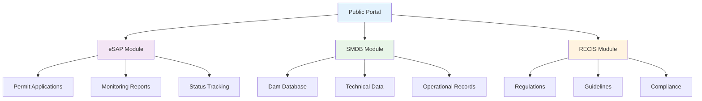

# 🏗️ BTB-Ku Dam Management System
> Integrated digital transformation platform for Indonesia's dam and water resource management

---

## 🎯 Project Overview

**Duration:** October 2022 - May 2023  
**Role:** Freelance Software Engineer (Backend Developer)  
**Client:** Balai Teknik Bendungan (BTB) - Directorate General of Water Resources, Ministry of Public Works

**BTB-Ku** is an integrated online information and application portal for **Balai Teknik Bendungan (BTB)** under the Directorate General of Water Resources, Ministry of Public Works. The portal provides unified access for permit applications, certifications, and monitoring related to dams and reservoirs.

🔗 **Live System:** [btbku.sda.pu.go.id](https://btbku.sda.pu.go.id/)

---

## 🚀 The Challenge

<strong>Manual & Fragmented System Issues</strong>

Before the integrated portal implementation, dam-related administration and reporting processes were predominantly manual, scattered across various units, and required complex inter-agency coordination:

- **Information Fragmentation** - Licensing documents, monitoring reports, and technical data were scattered
- **Regulatory Compliance** - Many procedures needed to comply with Ministry regulations regarding dams
- **Access & Transparency** - Applicants and stakeholders needed easier ways to submit applications and monitor status electronically

---

## 💡 Solution: BTB-Ku Platform

Portal **BTB-Ku** was designed as a unified service point to address these challenges by providing structured digital workflows for various types of applications, documentation, and monitoring.

### 🔧 Core Features & Capabilities

#### **eSAP (Electronic Certification and Monitoring)**
- Digital submission and management of design approvals, construction permits, initial reservoir filling permits, operational permits, function termination
- Periodic monitoring report submissions according to Ministry guidelines
- Users can view administrative and technical requirements for each type of application

#### **SMDB (Dam Management Database System)**
- Storage and management of technical dam databases
- Inventory data, inspection history, and operational dam data storage

#### **RECIS**
- Electronic permits/certification and guideline reinforcement
- Strengthens electronic application and monitoring functions

#### **Contact & Support**
- BTB office contact information (email and phone numbers)
- Service operational hours available in portal for user support

---

## 🛠️ My Technical Contributions

### Backend Developer Role (API Provider & Infrastructure)

As one of the executor developers contributing to BTB-Ku development—specifically for **eSAP, SMDB, and RECIS** services—my technical responsibilities included:

#### 1. **Backend Architecture & API Design**
- Designed modular backend architecture based on REST API to support decoupling between portal frontend and backend services
- Established API contracts (endpoints, request/response schema, validation) for: application submissions, document uploads, user authorization, application status tracking, dam master data management, and monitoring reports

#### 2. **Implementation & Integration**
- Implemented all backend endpoints using **PHP 7 (Laravel)** ensuring security standards (auth, role-based access), document validation, and API availability for inter-module integration
- Integrated APIs with portal frontend modules (application forms, monitoring dashboard, requirements pages) for consistent end-to-end data flow

#### 3. **Performance, Caching & Background Processing**
- Used **Redis** for caching read-heavy data (dam master data, requirements lists) to reduce MySQL query load and speed up responses
- Leveraged Redis as **broker for background tasks & queue** - large document validation, file conversion/scanning, email notifications, and periodic report generation run asynchronously to keep user requests responsive

#### 4. **Database & Reliability**
- Designed **MySQL** database schema for storing application data, status history, document metadata, and audit logs
- Implemented clean migrations and database seeds (Laravel migrations & seeders) for easier deployment/rollback

#### 5. **Deployment & Operations** (Infrastructure team collaboration)
- Collaborated with infrastructure team for deployment pipeline (CI/CD), production environment configuration, DB connection pooling setup, and API endpoint security (rate limiting, input sanitization)

---

## 📊 Results & Impact

| Metric/Area | Before (Manual/Fragmented) | After (BTB-Ku) |
|-------------|---------------------------|-----------------|
| **Application Method** | Manual & face-to-face | **Electronic via eSAP/BTB-Ku portal** |
| **Data Access & Transparency** | Limited | **Easier, centralized, users can view application status** |
| **Process Efficiency** | Slow, manual process dependent | **Faster (API + background jobs), automatic notifications** |
| **Operational Reliability** | Hard to standardize | **More structured: centralized DB, cache, job queue for heavy tasks** |

---

## 🔧 Technology Stack

- **Backend:** PHP 7.x, Laravel (REST API based)
- **Frontend:** Portal integration (public portal)
- **Database:** MySQL
- **Caching & Queue Broker:** Redis (caching + job queue)
- **Document Storage:** Object storage/file server (configured per institutional policy)
- **Infrastructure & Operations:** Web server + production configuration (collaborated with infra/ops team)

---

## 🎉 Key Achievements

✅ **Digital Transformation** - Converted manual processes to electronic workflows  
✅ **Unified Portal** - Integrated multiple services (eSAP, SMDB, RECIS) in one platform  
✅ **Performance Optimization** - Implemented Redis caching and background job processing  
✅ **Regulatory Compliance** - Ensured adherence to Ministry regulations and guidelines  
✅ **Enhanced Transparency** - Real-time application status tracking for users  
✅ **Scalable Architecture** - Modular design supporting future expansion  

---

*This system successfully modernized dam management services in Indonesia, providing efficient, transparent, and centralized digital access for all stakeholders involved in dam construction, operation, and maintenance.*
