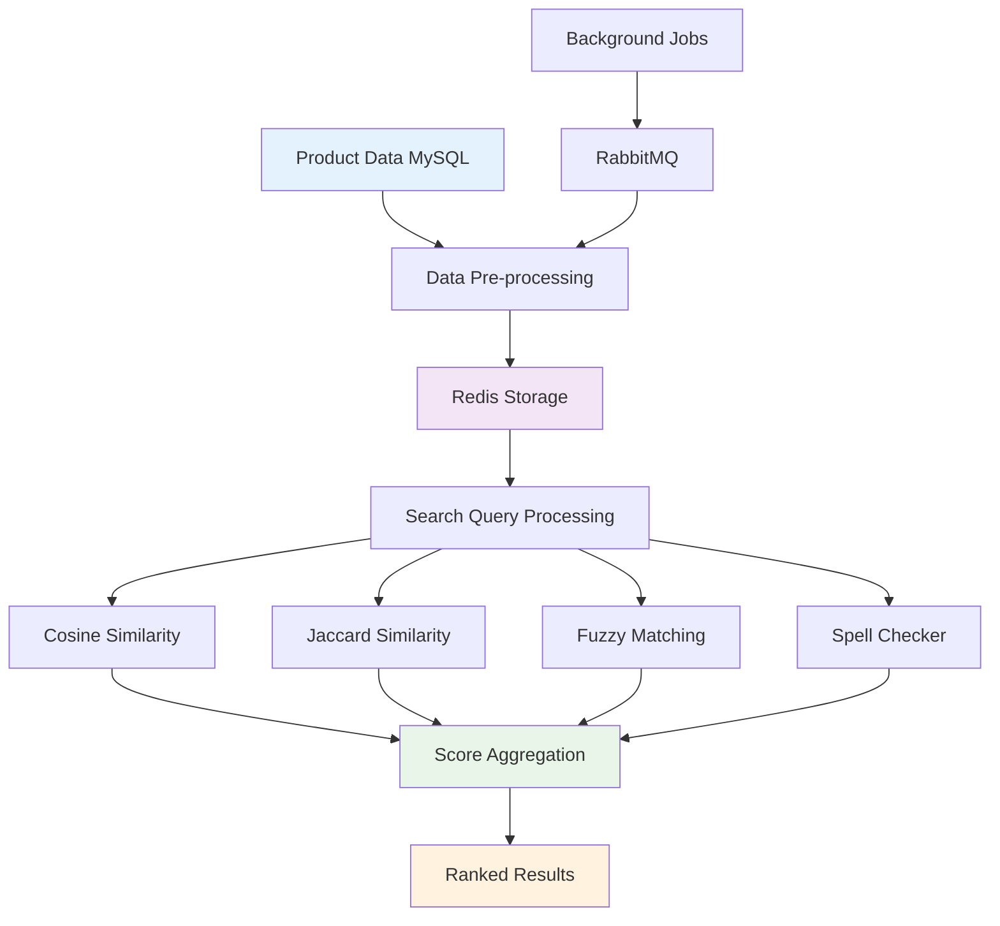
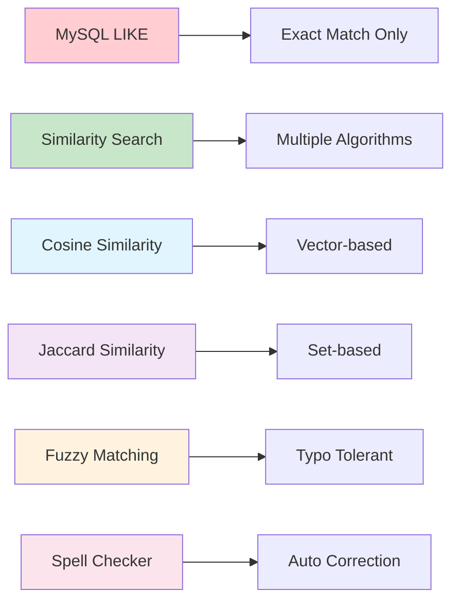
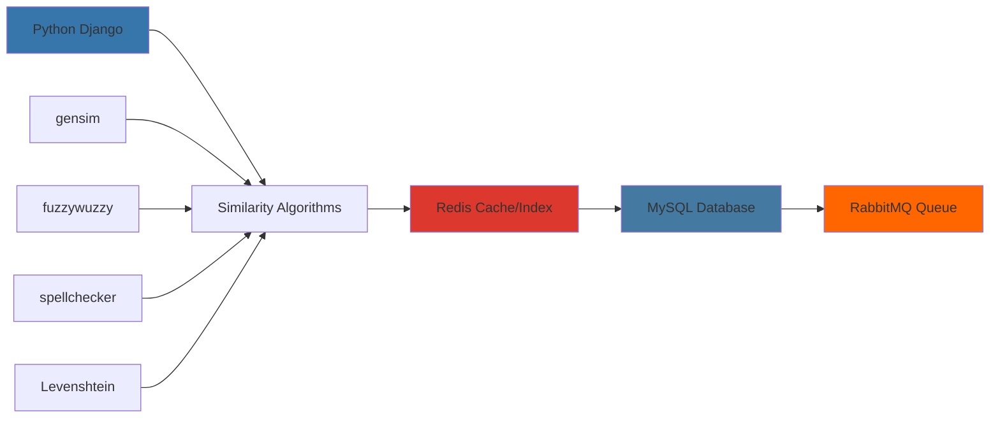

# 🧠 Intelligent Similarity Search System
> Advanced product and service search optimization for internal ERP tools

---

## 🎯 Project Overview

**Duration:** September 2023 - December 2023  
**Role:** Backend Engineer  
**Company:** Otoklix Indonesia

This project focused on **optimizing product and service search systems** in Otoklix's internal ERP application. The system is used by **Customer Service (CS)** teams to book products and services through internal tools.

Previously, the search system used simple approaches with *LIKE queries* in MySQL, resulting in limited search results, no typo tolerance, and frequent failures to find relevant products.

As a **Backend Engineer**, I was responsible for researching appropriate technology, designing search architecture, building data pipelines, and developing *similarity search* algorithms to make the search system more accurate and efficient.

---

## 🚀 The Challenge

<strong>Legacy Search System Limitations</strong>

Before this optimization, the search system faced several major constraints:

- **Limited Search Capability:** Queries using MySQL `LIKE` could only find data with exact spelling matches. Example: searching for `oli shell helix hx6` with input `shell hx6` returned no results
- **No Typo Tolerance:** CS staff often made typos or didn't write complete product names
- **Low Booking Process Efficiency:** CS needed more time to find products, slowing down customer booking processes
- **Infrastructure Limitations:** Due to cost efficiency policies, it wasn't possible to add new services like Elasticsearch or MongoDB

---

## 💡 Solution: Intelligent Similarity Search Implementation

To overcome these constraints, I built a **simple similarity search system** based on Python with a combination of various text search algorithms.

### 🔧 Core Features & Capabilities

#### **Layered Similarity Search**
User queries are processed first, then compared with product data using:
- **Cosine Similarity** - Vector-based text comparison
- **Jaccard Similarity** - Set-based similarity measurement
- **Fuzzy Matching** - (*fuzzywuzzy*, *Levenshtein distance*) for typo tolerance
- **Spell Checker** - Automatic word correction

#### **Product Data Pre-processing**
- Product data from MySQL processed and stored in Redis as hash (key = product_id, value = product attributes for search)
- Optimized data structure for fast similarity calculations

#### **Result Aggregation**
- Scores from multiple algorithms combined and sorted by highest similarity level
- Weighted scoring system for balanced results

#### **Phase 2: Indexing Optimization**
- Added indexing system in Redis to speed up search
- Index built based on words in product names, so only relevant data subsets are compared

---

## 🛠️ My Technical Contributions

### Backend Engineer Role

As the lead backend developer, I held key roles in:

#### 1. **Research & Solution Design**
- Conducted deep research on efficient similarity search technology without adding infrastructure costs
- Designed search pipeline architecture compatible with Otoklix ERP stack

#### 2. **Backend Development**
- Built *background process* for product data pre-processing using **RabbitMQ**
- Provided REST API for product and service search
- Implemented similarity search algorithms using **gensim, fuzzywuzzy, spellchecker, and python-Levenshtein**

#### 3. **Optimization & Indexing**
- Reduced response time with Redis indexing, making search faster despite growing product data
- Performed performance benchmarking between Phase 1 and Phase 2 to ensure significant improvements

---

## 📊 Algorithm Performance Comparison

## 📊 Results & Impact

The search system optimization delivered significant impact on CS team productivity and booking process efficiency:

| Metric | Before Optimization | After Optimization |
|--------|--------------------|--------------------|
| **Search Accuracy** | Low, dependent on exact input | **High, typo tolerant & name variations** |
| **Response Speed** | Slow (full data scan) | **Faster with Redis indexing** |
| **CS Productivity** | Often stuck finding products | **More efficient, faster booking** |
| **Internal User Experience** | Frustrating, often failed to find products | **More comfortable & satisfying** |

---

## 🔧 Technology Stack

Following Otoklix ERP's main stack:

- **Backend:** Python (Django Framework)
- **Database:** MySQL
- **Caching & Indexing:** Redis
- **Message Queue:** RabbitMQ (background pre-processing)
- **Web Server:** Nginx
- **Frontend:** React.js (Otoklix Internal ERP)

---

## 🎉 Key Achievements

✅ **Intelligent Search** - Transformed exact match to smart similarity-based search  
✅ **Typo Tolerance** - Built robust fuzzy matching and spell checking  
✅ **Performance Optimization** - Implemented Redis indexing for faster results  
✅ **Cost-Effective Solution** - Achieved advanced search without new infrastructure  
✅ **Enhanced Productivity** - Significantly improved CS team efficiency  
✅ **Scalable Architecture** - Modular design supporting future algorithm improvements  

---

## 💡 Technical Insights

This project provided deep learning in:
- **Text Similarity Algorithms** and their practical applications
- **Search Optimization** without expensive infrastructure
- **Redis Data Structures** for efficient indexing and caching
- **Algorithm Combination** for better search results
- **Performance Benchmarking** for measurable improvements

---

## 🔬 Algorithm Details

<strong>Similarity Search Implementation</strong>

**Phase 1: Basic Similarity**
- Cosine similarity for semantic matching
- Jaccard similarity for token overlap
- Fuzzy matching for typo tolerance

**Phase 2: Optimized with Indexing**
- Redis-based word indexing
- Subset matching for performance
- Weighted scoring combination

**Background Processing**
- Automatic data preprocessing
- Real-time index updates
- Queue-based architecture

---

*Overall, this optimization successfully transformed the search system from simple *exact match* to **intelligent search** that's more accurate, efficient, and user-friendly.*
