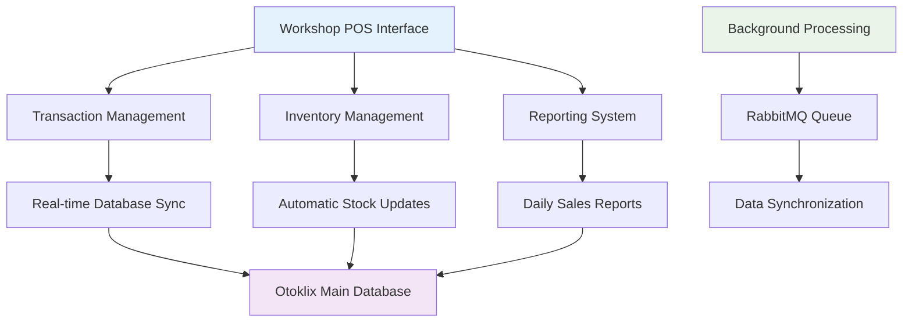
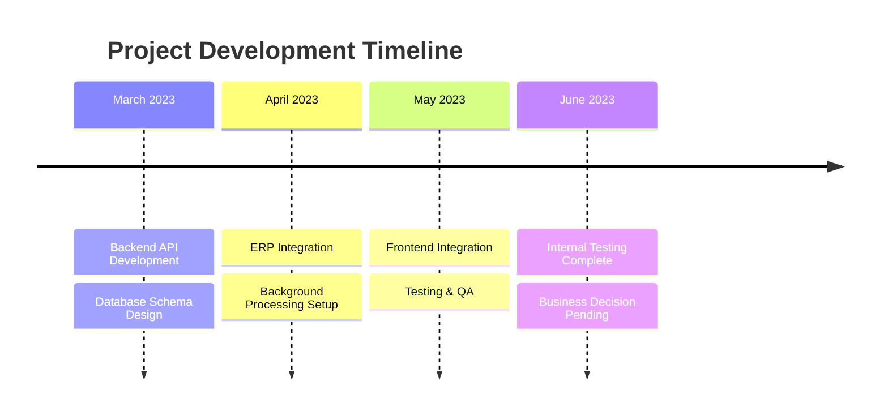
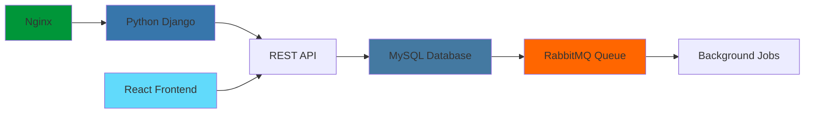

# 🛒 Otoklix POS System (GMS)
> Integrated Point of Sales system for automotive workshop management

---

## 🎯 Project Overview

**Duration:** March 2023 - June 2023  
**Role:** Backend Engineer  
**Company:** Otoklix Indonesia

The **Otoklix POS Application** is a web-based system I developed as part of the digitalization initiative within the Otoklix ecosystem. This project aimed to provide a modern cashier solution for workshops that integrates directly with **Otoklix's main database**, enabling real-time transaction and inventory management with enhanced efficiency.

---

## 🚀 The Challenge

<strong>Pre-Digital Workshop Operations Issues</strong>

Before this POS application, workshops within the Otoklix ecosystem faced significant operational challenges:

- **Limited Integration:** Sales systems in workshops weren't directly connected to Otoklix's main database, causing data synchronization delays
- **Manual Inventory:** Stock management was done manually, prone to delayed updates and recording errors
- **System Separation:** No unified system to manage transactions, inventory, and reports in an integrated manner
- **Low Operational Efficiency:** Without digitalization, financial and stock reports took considerable time to compile

---

## 💡 Solution: Integrated Otoklix POS Application

To address these challenges, I collaborated with the team to develop a **web-based POS application** that could be used directly in Otoklix partner workshops.

### 🔧 Core Features & Capabilities

#### **Real-Time Database Integration**
- All transactions directly connected to Otoklix's main database
- Instant synchronization of sales data across the ecosystem

#### **Automatic Inventory Management**
- Stock automatically updated with every sales transaction
- Real-time inventory tracking and management

#### **Standard POS Features**
- Sales transaction input
- Receipt printing
- Daily sales reports
- Transaction data compilation for business analytics

#### **Web-Based Architecture**
- Browser-accessible application without additional cashier device installation requirements
- Cross-platform compatibility and easy deployment

---

## 🛠️ My Technical Contributions

### Backend Engineer Role

In this project, I held full responsibility for **backend development**.

#### 1. **REST API Provision**
I developed various **API endpoints** used by the POS application, including:
- Sales transaction APIs
- Inventory management APIs
- Financial and daily transaction report APIs

#### 2. **ERP System Integration**
I designed the backend to connect directly with Otoklix's ERP database, enabling inventory management that was previously manual to now **automatically synchronize** with POS transactions.

#### 3. **Background Processing**
Using **RabbitMQ**, I prepared a queue system to handle background processes, such as large-scale data synchronization or periodic reports.

---

## 📊 Project Results & Status

Although this project was successfully built to the internal testing stage, the Otoklix POS application **was not released to production** due to business considerations and factors within the company.

However, from a technical perspective, the application demonstrated:

| Metric | Before Otoklix POS | After Otoklix POS (Internal Testing) |
|--------|--------------------|------------------------------------|
| **Data Integration** | Separate, manual updates | **Automatic & real-time** |
| **Inventory Management** | Manual & error-prone | **Integrated with transactions** |
| **Reporting** | Manual compilation | **Digital & instant** |

---

## 🔧 Technology Stack

- **Backend:** Python (Django Framework)
- **Frontend:** React.js (Web-based POS UI)
- **Database:** MySQL
- **Message Broker/Background Process:** RabbitMQ
- **Web Server & Infrastructure:** Nginx

---

## 🎉 Key Achievements

✅ **Real-time Integration** - Connected workshop operations with main Otoklix database  
✅ **Automated Inventory** - Eliminated manual stock management errors  
✅ **Background Processing** - Implemented scalable queue system for heavy operations  
✅ **API-First Architecture** - Built robust REST API foundation  
✅ **Cross-platform Compatibility** - Web-based solution accessible from any device  
✅ **ERP Integration** - Successfully connected with existing Otoklix ERP system  

---

## 💡 Technical Learnings

This project became an important foundation for understanding:
- **ERP System Integration** patterns and best practices
- **Background job processing** with message queues
- **Real-time data synchronization** challenges and solutions
- **API design** for complex business workflows
- **Workshop digitalization** requirements and constraints

---

*This project established an important initial foundation for ERP system development and operational digitalization of workshops at Otoklix, demonstrating the technical feasibility of real-time integrated POS solutions.*
