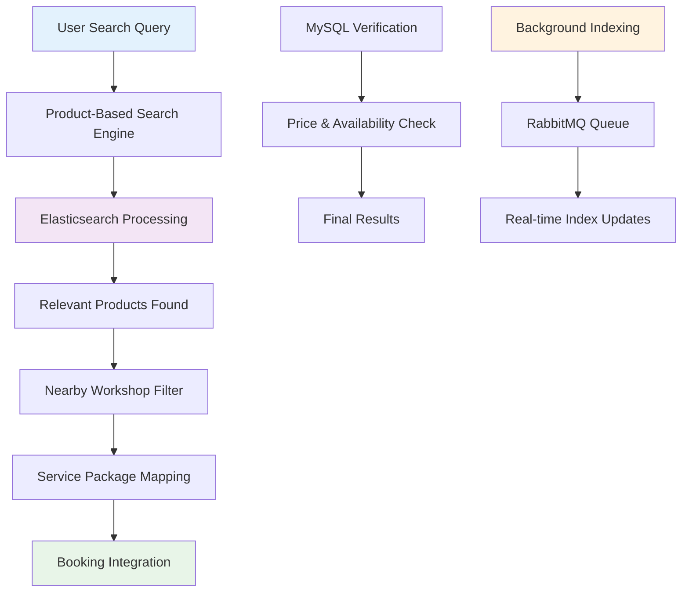
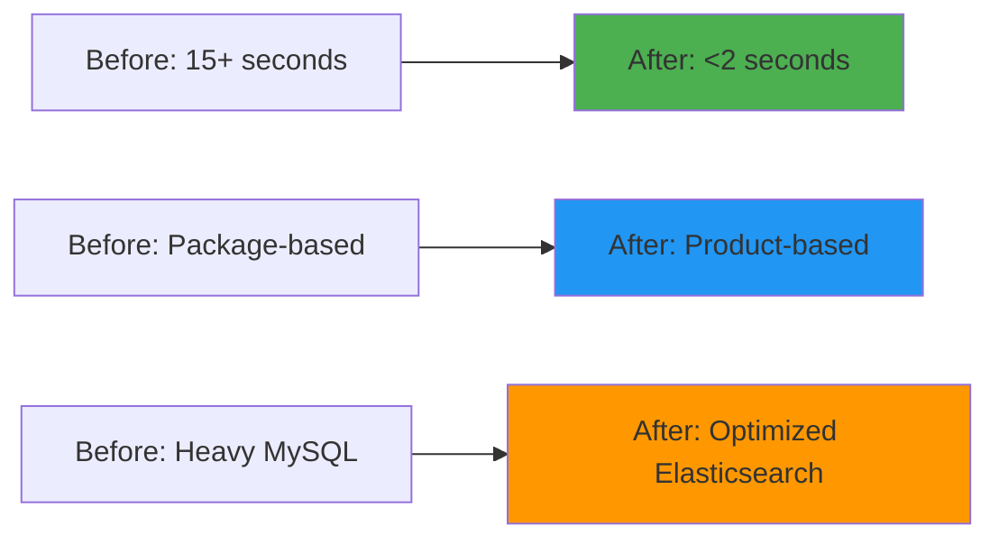

# 🔍 Otoklix Search Engine Optimization
> Customer app search performance and relevance enhancement project

---

## 🎯 Project Overview

**Duration:** August 2022 - November 2022  
**Role:** Backend Engineer  
**Company:** Otoklix Indonesia

As one of the main B2C services in the automotive sector, **Otoklix** provides a digital platform for automotive product and workshop service bookings. However, the search functionality in the customer application (*CustApp*) faced significant challenges in both performance and search result relevance.

Through this project, I was responsible for **search system optimization** utilizing **Elasticsearch**, data structure transformation, and backend workflow improvements. The result was a faster, more relevant, and efficient search system that significantly improved user experience.

---

## 🚀 The Challenge

<strong>Legacy Search System Limitations</strong>

Before optimization, the search feature faced several critical issues:

- **Package-Based Search:** Search system was still based on *service packages*, making results less relevant when users searched for specific products or services
- **Poor Performance:** Search response times could reach over **15 seconds**, far from ideal standards for user experience
- **Heavy Query Load:** Despite using Elasticsearch, the backend still performed extensive price calculations with numerous additional MySQL queries, making the process slow
- **Excessive Complexity:** Package-based search required complex MySQL queries for each result, making system optimization difficult

---

## 💡 Solution: Comprehensive Search Optimization

To address these challenges, I implemented a comprehensive approach to redesign the search system.

### 🔧 Core Features & Capabilities

#### **Transition from Package-Based to Product-Based Search**
- Transformed search to focus on products (type, brand, model), then cascade to relevant service packages and workshops
- More intuitive and relevant search experience for users

#### **Elasticsearch Optimization**
- Redesigned document structure and indices in Elasticsearch
- Stored more ready-to-use data in Elasticsearch to reduce MySQL dependency

#### **Integrated & Simplified Search**
Users now need only **1 search endpoint** for:
1. Search products
2. Select nearby workshops providing the product/package
3. Choose service package
4. Make booking

#### **Minimal MySQL Queries**
MySQL queries only performed for final verification such as product availability and latest pricing to maintain data accuracy

---

## 🛠️ My Technical Contributions

### Backend Engineer Role

In this project, I held full backend responsibility with primary duties including:

#### 1. **Research & Technology Design**
- Analyzed weaknesses in previous search architecture
- Researched best practices for Elasticsearch implementation in product and service search
- Redesigned data structure and search workflows

#### 2. **Development & Integration**
- Restructured Elasticsearch documents and indices to fit product-based search model
- Built new, more concise, fast, and user-friendly REST APIs for frontend
- Ensured efficient data flow from backend to frontend without excessive query load

#### 3. **System Performance Optimization**
- Reduced MySQL dependency by storing ready-to-use data in Elasticsearch
- Integrated **RabbitMQ** for handling *background indexing* whenever product/workshop data changes from ERP
- Performed benchmarking and performance testing until search response time was drastically reduced

---

## 📊 Results & Impact

The search optimization implementation resulted in significant improvements:

| Metric | Before Optimization | After Optimization |
|--------|--------------------|--------------------|
| **Search Model** | Package-Based | **Product-Based & Integrated** |
| **Response Time** | > 15 seconds | **< 2 seconds** |
| **Result Relevance** | Low | **High (based on product, package, and location)** |
| **Query Efficiency** | Many MySQL Queries | **Minimal Queries (more in Elasticsearch)** |

---

## 🔧 Technology Stack

- **Backend:** Python (Django Framework)
- **Database:** MySQL
- **Search Engine:** Elasticsearch
- **Message Queue & Background Jobs:** RabbitMQ (for Elasticsearch index updates)

---

## 🎉 Key Achievements

✅ **87% Performance Improvement** - Response time reduced from 15+ seconds to <2 seconds  
✅ **Enhanced Search Relevance** - Product-based search with location and service integration  
✅ **Reduced Server Load** - Minimized MySQL queries through Elasticsearch optimization  
✅ **Scalable Architecture** - Background indexing system for real-time data updates  
✅ **Improved User Experience** - Single endpoint for complete search-to-booking flow  
✅ **System Reliability** - Robust error handling and fallback mechanisms  

---

## 💡 Technical Insights

This project provided valuable learnings in:
- **Elasticsearch Architecture** design for complex search requirements
- **Data Denormalization** strategies for performance optimization
- **Background Processing** patterns for real-time search index updates
- **API Design** for seamless frontend integration
- **Performance Benchmarking** and optimization techniques

---

*Overall, this project successfully improved the **user experience** of the Otoklix application, strengthened search speed and relevance, and supported B2C service growth in the digital automotive industry.*
