# 🏛️ SISDABIMA Digital Transformation
> Revolutionary digital public service platform for water resources management

---

## 🎯 Project Overview

**Duration:** September 2021 - November 2021  
**Role:** Freelance Software Engineer (Architect, Backend Developer & Technical Lead)  
**Client:** DSDABMBK (Water Resources, Roads & Construction Office) - Bekasi Regency

**SISDABIMA (Water Resources and Road Management Service System)** is a web-based application I developed to revolutionize service systems at the **Water Resources, Roads & Construction Office (DSDABMBK) Bekasi Regency**.

This project transformed services that were previously **100% manual** into an integrated digital system, resulting in **70% reduction in service processing time** and enabling real-time application status tracking for citizens.

🎥 **Project Demo:** [YouTube Video](https://www.youtube.com/watch?v=u0F0eP5Znsc)

---

## 🚀 The Challenge

<strong>Manual Service System Problems</strong>

Before SISDABIMA, DSDABMBK faced major challenges:

- **Manual Processes:** All application workflows were face-to-face and paper-based
- **Long Service Times:** Average processing took **7-14 working days**
- **Lack of Transparency:** Applicants couldn't track their application status
- **Limited Digital Legitimacy:** No legal framework for electronic services

This created **high administrative burdens**, service delays, and reduced citizen satisfaction.

---

## 💡 Solution: SISDABIMA Digital Platform

As a solution, I developed an **integrated digital platform** with end-to-end digitalized service workflows.

### 🔧 Core Features & Capabilities

#### **Integrated Online Services**
- Citizens can submit service applications from anywhere, 24/7
- Complete digital workflow from submission → verification → scheduling → document issuance

#### **Process Transparency**
- Real-time status tracking for applicants
- Automated notification system for status updates

#### **Strong Legal Foundation**
- System operations supported by **Bekasi Regent Regulation No. 64 of 2021**
- Fully compliant with local government digital service requirements

#### **Priority Services**
- Initial phase focused on **flood management** and **concrete material testing**
- Two most critical field requirements identified

---

## 🛠️ My Technical Contributions

### Architect, Backend Developer & Technical Lead

I handled the complete technical development cycle, from architecture design to production deployment.

#### 1. **Architecture Design & Technology Selection**
- Designed **REST API-based architecture** despite using CodeIgniter 3, to separate backend & frontend and enable future integrations
- Selected **Redis** not only for *caching*, but also as **queue system** to keep application responsive under high load

#### 2. **Backend Development & Integration**
- Built all **REST API endpoints**: authentication, master data management, to business logic services
- Integrated APIs with Bootstrap-based frontend for smooth data flow according to UX design
- Ensured end-to-end testing met department & regulatory requirements

#### 3. **Deployment & Infrastructure**
- Designed and managed infrastructure on **local private cloud**
- My tasks included:
  - Zero-to-production server setup on **Ubuntu Linux**
  - **Apache Web Server** + **PHP 7.3** installation & optimization
  - **MySQL** + **Redis** management
  - Server security hardening & performance monitoring
- Direct coordination with department officials & frontend team for field-ready system

---

## 📊 Results & Impact

SISDABIMA implementation resulted in tangible improvements in public services:

| Metric | Before SISDABIMA | After SISDABIMA |
|--------|------------------|-----------------|
| **Service Method** | Manual & Face-to-face | **Online & Digital** |
| **Processing Time** | 7-14 days | **2-4 days** |
| **Transparency** | No tracking | **Real-time tracking** |
| **Accountability** | Hard to audit | **Fully documented** |
| **Service Capacity** | ±100 applications/month | **> 500 applications/month** |

```mermaid
graph LR
    A[Before: 7-14 days] --> B[After: 2-4 days]
    C[Before: ±100/month] --> D[After: 500+/month]
    E[Before: Manual] --> F[After: Digital]
    
    style B fill:#4CAF50
    style D fill:#2196F3
    style F fill:#FF9800
```

---

## 🔧 Technology Stack

- **Backend:** PHP 7.3, CodeIgniter 3 (REST API Based)
- **Frontend:** Bootstrap 3
- **Database:** MySQL
- **Caching & Queue System:** Redis
- **Infrastructure & Web Server:** Ubuntu Server, Apache

---

## 🎉 Key Achievements

✅ **70% Time Reduction** - Processing time decreased from 7-14 days to 2-4 days  
✅ **500% Capacity Increase** - From ±100 to >500 applications per month  
✅ **Digital Transformation** - Complete migration from manual to digital processes  
✅ **Legal Compliance** - Supported by official government regulation  
✅ **Real-time Transparency** - Citizens can track application status instantly  
✅ **Full Infrastructure Setup** - From server setup to production deployment  

---

## 💡 Technical Insights

This project provided valuable experience in:
- **Government Digital Transformation** requirements and challenges
- **REST API Architecture** with legacy frameworks
- **Redis Queue Systems** for responsive applications
- **Full-stack Infrastructure Management** from server to application
- **Regulatory Compliance** in public service systems

---

## 🏆 Recognition & Impact

- **Successful Digital Transformation** - First fully digital service system in DSDABMBK
- **Improved Citizen Satisfaction** - Faster, more transparent service delivery
- **Model Implementation** - Example of successful public service digitalization in Bekasi Regency
- **Legal Framework Establishment** - Contributed to official regulation development

---

*Overall, this project not only **improved citizen satisfaction**, but also became a successful example of public service digitalization in Bekasi Regency, demonstrating the transformative power of well-designed digital solutions.*
