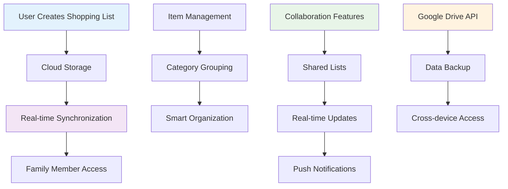
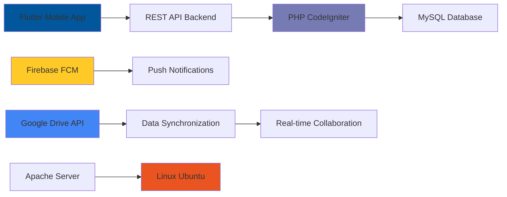

# 🛍️ SMOP Shopping App
> Smart collaborative shopping list application with real-time synchronization

---

## 🎯 Project Overview

**Duration:** April 2021 - June 2021  
**Role:** Backend & Deployment Specialist  
**Company:** PT Togu Inovasi Teknologi

**SMOP (Smart Shopping List)** is a mobile application (Android & iOS) developed by **PT Togu Inovasi Teknologi** to revolutionize how users plan and conduct daily shopping activities. The app was designed as an intelligent solution to address common problems like unorganized shopping lists, forgotten items, and coordination difficulties among family members.

---

## 🚀 The Challenge

<strong>Conventional Shopping Process Problems</strong>

Conventional shopping processes are often inefficient and prone to errors. Main challenges included:

- **Conventional Lists:** Users often used paper notes or general note-taking apps without shopping-specific features
- **Difficult Coordination:** Hard to share and synchronize shopping lists in *real-time* with spouse or family members, often causing duplicate purchases or missed items
- **Disorganized:** Long shopping lists became hard to read and weren't grouped by product categories, making in-store shopping longer
- **Data Loss Risk:** Lists stored locally on devices risked being lost if devices were damaged or lost

---

## 💡 Solution: SMOP Smart Shopping App

SMOP came as an innovative solution providing a centralized and feature-rich platform for shopping list management.

### 🔧 Core Features & Capabilities

#### **Smart Shopping Lists**
- Users can create multiple shopping lists, group items by category, and easily mark purchased items
- Intelligent categorization for better organization

#### **Real-time Sharing & Collaboration**
- SMOP's flagship feature: ability to share shopping lists with other users
- Every change (adding or marking items) instantly synchronizes across all connected devices

#### **Smart Notifications**
- Proactive notification system reminding users about active shopping lists or updates from collaborators
- Context-aware alerts and reminders

#### **Cloud Storage**
- All shopping lists securely stored in the cloud, enabling access from any device and preventing data loss
- Automatic backup and synchronization

#### **Multi-Platform**
- Built using Flutter, SMOP provides consistent and smooth user experience on both Android and iOS platforms
- Single codebase for multiple platforms

---

## 🛠️ My Technical Contributions

### Backend & Deployment Specialist

As the lead server-side developer, I served as the digital backbone ensuring all SMOP's smart and collaborative features run reliably and fast.

#### 1. **Architecture Development & REST API Provision**
I designed and built the entire backend infrastructure using CodeIgniter 3. My main focus was providing a series of *robust* and efficient REST APIs to handle all mobile application needs, including:
- User account management and authentication
- CRUD (*Create, Read, Update, Delete*) operations for shopping lists and items
- Business logic for application-specific features

#### 2. **Third-party Service Integration Orchestration**
To bring advanced features to life, I performed deep integrations with several external services:

**Firebase Cloud Messaging (FCM):** I implemented Firebase integration to build a *push notification* system. This enables the app to send *real-time* notifications to users when their shopping lists are updated by collaborators.

**Google Drive API:** This is the core of SMOP's collaboration feature. I designed a system leveraging Google Drive to store shopping list data. This enables the **list sharing** function with other users and most importantly, **real-time change synchronization** among collaborators.

#### 3. **Server Management & Deployment**
I was fully responsible for production environment deployment and maintenance. This included Linux Ubuntu server configuration, Apache Web Server and PHP 7 optimization, and MySQL database management to ensure high application availability and performance for all users.

---

## 📊 Technical Architecture

## 📊 Results & Impact

The SMOP application was successfully launched and received positive responses from users seeking practical solutions for shopping management. This project significantly:

| Feature | Before SMOP | After SMOP |
|---------|-------------|------------|
| **Coordination** | Difficult family collaboration | **Easy collaboration for families and roommates** |
| **Efficiency** | Time wasted in stores | **Reduced store time with organized lists** |
| **Error Reduction** | Risk of forgotten or duplicate items | **Minimized forgotten items and duplicate purchases** |
| **Data Security** | Risk of lost paper lists | **Cloud backup and synchronization** |

---

## 🔧 Technology Stack

- **Backend:** PHP 7, CodeIgniter 3
- **Mobile Framework:** Flutter (Android & iOS)
- **Database:** MySQL
- **Third-party Services:** Firebase Cloud Messaging, Google Drive API
- **Infrastructure & Web Server:** Linux Ubuntu Server, Apache

---

## 🎉 Key Achievements

✅ **Real-time Collaboration** - Successfully implemented family shopping list sharing  
✅ **Cross-platform Solution** - Single Flutter app for Android and iOS  
✅ **Smart Notifications** - Context-aware push notification system  
✅ **Cloud Integration** - Google Drive API for seamless data synchronization  
✅ **Scalable Architecture** - Backend designed to handle multiple concurrent users  
✅ **Production Deployment** - Full server setup and application deployment  

---

## 💡 Technical Learnings

This project provided valuable experience in:
- **Mobile Backend Architecture** design and implementation
- **Third-party API Integration** with Firebase and Google services
- **Real-time Data Synchronization** challenges and solutions
- **Multi-platform Development** considerations and best practices
- **Cloud Storage Integration** for collaborative applications

---

## 🔄 Integration Complexity

<strong>Google Drive API Integration Details</strong>

**Challenge:** Implementing real-time collaboration through Google Drive
**Solution:** 
- Shopping lists stored as structured data in Google Drive
- Real-time synchronization through Drive API webhooks
- Conflict resolution for simultaneous edits
- Secure sharing mechanisms with permission management

**Firebase FCM Integration:**
- Push notification triggers for list updates
- User preference management for notifications
- Cross-platform notification handling

---

*This project demonstrated my ability to design complex backend architecture and integrate various technologies to create functional and beneficial consumer products, proving the technical feasibility of real-time collaborative shopping solutions.*
