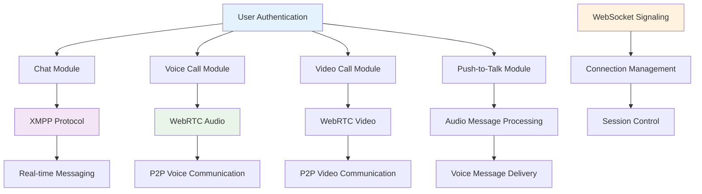
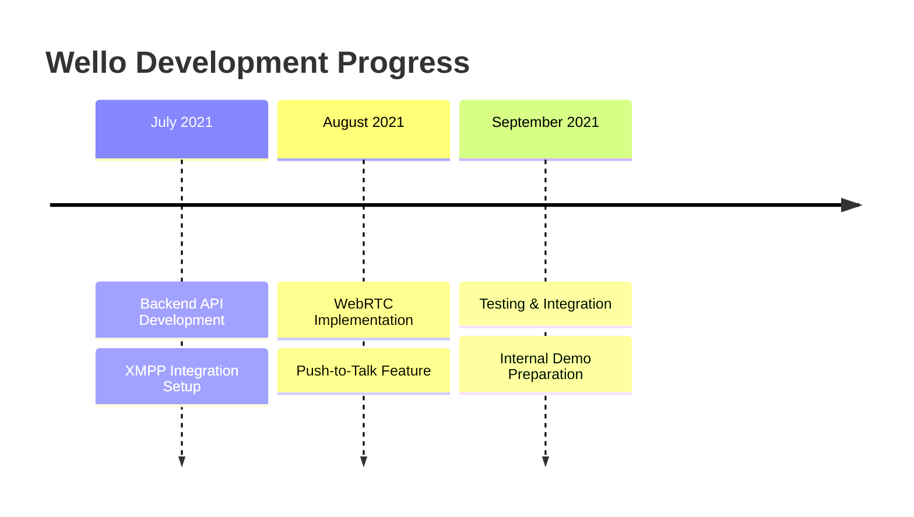

# 💬 Wello Communication Platform
> Real-time social media chat application with advanced communication features

---

## 🎯 Project Overview

**Duration:** July 2021 - September 2021  
**Role:** Backend & Real-Time Communication Engineer  
**Company:** PT TOGU Inovasi Teknologi

**Wello** is a social media application developed by **PT TOGU Inovasi Teknologi** as part of the ambitious *"Hundred Apps Project"* initiative. The application was designed to deliver modern communication experiences comparable to popular platforms like WhatsApp, Telegram, and LINE.

Wello integrates various real-time communication features, from **private chat**, **group chat**, **voice calls**, **video calls**, to the unique **push-to-talk (walkie-talkie)** feature. This project became one of the early milestones in my career journey, where I played a role in building the backend foundation and real-time communication integration.

---

## 🚀 The Challenge

<strong>Real-Time Communication Technical Challenges</strong>

In designing a real-time communication application, the team faced several complex technical challenges:

- **Real-Time Communication:** Required reliable protocols to support *low latency* needs for chat, voice calls, and video calls
- **Different Technology Integration:** Needed to combine **WebRTC**-based services for voice and video calls with **XMPP** for chat to function seamlessly
- **Initial Scalability:** System had to handle hundreds to thousands of simultaneous users, even in early development stages
- **Time Constraints:** This project ran parallel with other applications under the *Hundred Apps* initiative, requiring efficient development

---

## 💡 Solution: Wello Communication Platform

To address these challenges, I contributed to designing and implementing the **core backend** and **real-time communication** integration for the Wello application.

### 🔧 Core Features & Capabilities

#### **Chat & Group Chat**
- Instant messaging with **XMPP** as communication protocol
- Support for individual and group conversations
- Message history and status tracking

#### **Voice Call & Video Call**
- Built with **WebRTC** for smooth voice and video communication
- Peer-to-peer connection for optimal performance
- Call quality optimization and network adaptation

#### **Push-to-Talk (Walkie-Talkie)**
- Unique feature enabling quick short voice message sending
- Instant voice message delivery system
- Optimized for mobile usage patterns

#### **Backend-Frontend Integration**
- Backend provides REST API and WebSocket for data synchronization between server and Android application
- Real-time event handling and state management

---

## 🛠️ My Technical Contributions

### Backend & Real-Time Communication Engineer

In the Wello project, I held primary responsibility on the backend side, from research and design to technical implementation:

#### 1. **Research & System Design**
- Conducted technology research for real-time communication: **XMPP**, **WebRTC**, and **WebSocket**
- Designed database and system architecture to accommodate chat, call, and group features

#### 2. **Backend Implementation & Integration**
- Built **REST API** for authentication, user management, and basic communication workflows
- Integrated **XMPP** for chat and group chat features
- Provided **WebSocket signaling server** to support **WebRTC** (voice & video calls)
- Developed special workflow for **push-to-talk** feature

#### 3. **Deployment & Maintenance**
- Handled initial deployment on company internal servers
- Performed monitoring and bug fixes during internal development phase

---

## 📊 Technical Architecture

```mermaid
graph LR
    A[Android Native App] --> B[REST API]
    B --> C[PHP CodeIgniter Backend]
    C --> D[MySQL Database]
    
    E[XMPP Server] --> F[Chat Protocol]
    G[WebRTC] --> H[Voice/Video Calls]
    I[WebSocket] --> J[Signaling Server]
    
    K[Push-to-Talk] --> L[Voice Processing]
    
    style A fill:#A4C639
    style C fill:#777BB4
    style E fill:#0052CC
    style G fill:#333333
    style I fill:#4F4F4F
```

## 📊 Project Results & Development Timeline

Although this project did not reach **production release** stage because I decided to continue my career at another company, my contributions laid important foundations for Wello:

| Aspect | Before Wello | After Wello Implementation |
|--------|-------------|---------------------------|
| **Communication** | Only manual via other chat apps | **Internal platform available with chat, group, voice & video calls** |
| **Real-Time Technology** | None available | **WebRTC & XMPP successfully integrated** |
| **Unique Features** | None | **Push-to-Talk (Walkie-Talkie) available** |

---

## 🔧 Technology Stack

- **Backend:** PHP 7.x (CodeIgniter 3)
- **Database:** MySQL
- **Chat Protocol:** XMPP
- **Voice & Video Call:** WebRTC
- **Signaling:** WebSocket
- **Frontend (Mobile):** Java Android Native

---

## 🎉 Key Achievements

✅ **Real-Time Communication Stack** - Successfully integrated XMPP and WebRTC  
✅ **Unique Feature Development** - Implemented push-to-talk walkie-talkie functionality  
✅ **Multi-Protocol Integration** - Seamlessly combined different communication protocols  
✅ **Signaling Server** - Built WebSocket-based signaling for WebRTC connections  
✅ **Scalable Backend** - Designed API architecture for multiple communication modes  
✅ **Foundation Establishment** - Created robust base for future communication features  

---

## 💡 Technical Insights

This project provided valuable experience in:
- **Real-Time Communication (RTC)** technology and implementation
- **Multi-Protocol Integration** challenges and solutions
- **WebRTC Signaling** server design and development
- **XMPP Protocol** for instant messaging systems
- **Mobile Backend APIs** for communication applications

---

## 🔬 Technical Deep Dive

<strong>WebRTC & XMPP Integration Details</strong>

**WebRTC Implementation:**
- Peer-to-peer connection establishment
- ICE candidate exchange via WebSocket signaling
- Media stream management for audio/video
- Network adaptation and quality optimization

**XMPP Integration:**
- Real-time messaging protocol implementation
- Presence and status management
- Group chat room functionality
- Message delivery and receipt confirmation

**Push-to-Talk Architecture:**
- Voice recording and compression
- Real-time audio message delivery
- Integration with existing chat infrastructure

---

*This project became one of my valuable experiences in mastering **real-time communication** (RTC), API-based backend architecture, and multi-protocol integration for modern communication applications, providing a strong foundation for future communication system development.*
