# 👨‍💻 **Aziz Ruri Suparman**
## *Senior Backend Engineer • Spesialis Optimasi Performa • Sistem 87% Lebih Cepat*

 

---

## 🎯 **Ringkasan Eksekutif • Mengapa Merekrut Saya?**

<table style="border: none;">
<tr>
<td align="center" width="20%" style="border: none;">

### **⚡ 87%**
**Peningkatan Performa**  
*15+ detik → <2 detik*  
Ahli optimasi pencarian

</td>
<td align="center" width="20%" style="border: none;">

### **🚀 500%**
**Peningkatan Kapasitas**  
*100 → 500+ aplikasi/bulan*  
Spesialis arsitektur scalable

</td>
<td align="center" width="20%" style="border: none;">

### **🏦 8**
**Proyek Besar**  
*Perbankan • Pemerintahan • Otomotif*  
Keahlian lintas industri

</td>
<td align="center" width="20%" style="border: none;">

### **💰 5+**
**Tahun Pengalaman**  
*Sistem real-time • Event-driven*  
Solusi production-ready

</td>
<td align="center" width="20%" style="border: none;">

### **📞 Siap**
**Interview**  
*Tersedia segera*  
[**📧 Hubungi Sekarang**](mailto:me@ruriazz.com)

</td>
</tr>
</table>

---

> **"Saya tidak hanya menulis kode—saya merancang solusi yang mentransformasi bisnis dan menyenangkan pengguna"**

**Senior Backend Engineer** dengan 5+ tahun pengalaman memberikan **dampak terukur** di sektor fintech, otomotif, dan pemerintahan. Saya mengspesialisasi diri dalam **sistem performa tinggi**, **arsitektur real-time**, dan **solusi scalable** yang mendorong pertumbuhan bisnis.

**🎯 Value Proposition:** Mengubah tantangan teknis kompleks menjadi solusi elegan dan menguntungkan dengan ROI terbukti.

### **🔥 Area Dampak Langsung**

---

## 📊 **Metrik Performa yang Penting**

<table>
<tr>
<td width="50%" valign="top">

**Dampak Optimasi Pencarian**
- **87% peningkatan performa**
- **Aplikasi customer Otoklix**
- **Redesain arsitektur Elasticsearch**

```mermaid
graph LR
    D["🏛️ Kapasitas Pemerintah"] 
    E["100 aplikasi/bulan"] 
    F["500+ aplikasi/bulan"]
    D --> E
    E --> F
    
    style D fill:#e3f2fd
    style E fill:#ffebee
    style F fill:#e8f5e8
```

</td>
<td width="50%" valign="top">

**Pencapaian Skalabilitas**
- **500% peningkatan kapasitas**
- **Transformasi digital pemerintah**
- **Optimasi Redis & otomasi**

</td>
</tr>
</table>

---

## � **Yang Membuat Saya Berbeda**

<table>
<tr>
<td align="center" width="25%">

**⚡ Fokus Performa**  
*87% sistem lebih cepat*  
Response time sub-detik  
Peningkatan kapasitas 500%

</td>
<td align="center" width="25%">

**🏗️ Keunggulan Arsitektur**  
*Desain event-driven*  
Komunikasi real-time  
Microservices scalable

</td>
<td align="center" width="25%">

**🎯 Dampak Bisnis**  
*Hasil terukur*  
Solusi cost-effective  
Optimasi user experience

</td>
<td align="center" width="25%">

**🤝 Keahlian Versatile**  
*Pengalaman lintas industri*  
Pemerintah hingga fintech  
Startup hingga enterprise

</td>
</tr>
</table>

---

## 📋 **Navigasi Portfolio**

*Akses cepat ke yang paling penting bagi Anda*

**🚀 [Jadwalkan Interview](mailto:me@ruriazz.com?subject=Peluang%20Interview%20-%20Backend%20Engineer&body=Halo%20Aziz,%0A%0ASaya%20telah%20meninjau%20portfolio%20Anda%20dan%20ingin%20membahas%20peluang%20Backend%20Engineer.%0A%0APerusahaan:%20%0APosisi:%20%0AMetode%20kontak%20yang%20disukai:%20%0A%0AMenantikan%20untuk%20terhubung!)**

| Bagian | Yang Akan Anda Temukan | Mengapa Ini Penting | Akses Langsung |
|--------|------------------------|---------------------|----------------|
| 🎯 **[Proyek Unggulan](./projects/README.md)** | 8 proyek flagship dengan metrik ROI | Lihat dampak bisnis terukur | [📊 Lihat Dampak](./projects/README.md) |
| 💼 **[Pengalaman Profesional](./experience/README.md)** | 5+ tahun di Perbankan, Pemerintahan, Otomotif | Memahami versatilitas & pertumbuhan | [📈 Lihat Progres](./experience/README.md) |
| 🛠️ **[Keahlian Teknis](./skills/README.md)** | Expertise teknologi production-ready | Evaluasi kesesuaian teknis | [⚡ Cek Keahlian](./skills/README.md) |
| 📞 **Kontak** | Saluran komunikasi langsung | Mulai percakapan | [📧 Email Sekarang](mailto:me@ruriazz.com) |

---

## 🎯 **Highlight Proyek Unggulan**

*Proyek nyata yang memberikan dampak transformational*

### 🏦 **[Sistem Auto-Assignment Video Call SMBC](./projects/smbc-sistem-video-call.md)**
**Revolusi Perbankan Melalui Arsitektur Real-time**

**🎯 Tantangan:** Transformasi sistem polling yang tidak efisien yang menyebabkan beban server dan pengalaman pengguna buruk  
**⚡ Solusi:** Arsitektur event-driven dengan Redis Stream/Sorted Set + notifikasi real-time WebSocket  
**📊 Dampak:** Eliminasi overhead server, assignment berbasis prioritas, efisiensi customer service meningkat

---

### 🏗️ **[Platform Manajemen Bendungan BTB-Ku](./projects/btb-ku-manajemen-bendungan.md)**
**Transformasi Digital Pemerintah dalam Skala Besar**

**🎯 Tantangan:** Proses perizinan manual di seluruh manajemen bendungan Kementerian PUPR  
**⚡ Solusi:** Platform digital terintegrasi dengan REST API modular, Redis caching, background processing  
**📊 Dampak:** Digitalisasi workflow pemerintah, transparansi meningkat, penyampaian layanan lebih efisien

---

### 🔍 **[Sistem Pencarian Similarity Cerdas](./projects/intelligent-similarity-search.md)**
**Pencarian Bertenaga AI yang Benar-benar Berfungsi**

**🎯 Tantangan:** Pencarian ERP terbatas pada exact match, membuat frustasi tim customer service  
**⚡ Solusi:** Pencarian similarity multi-algoritma (Cosine, Jaccard, Fuzzy matching, spell checker)  
**📊 Dampak:** Peningkatan akurasi pencarian 85%, produktivitas CS meningkat dramatis

---

### 🛒 **[Optimasi Search Engine Otoklix](./projects/otoklix-optimasi-pencarian.md)**
**Performance Engineering yang Mentransformasi User Experience**

**🎯 Tantangan:** Pencarian customer app membutuhkan 15+ detik dengan relevansi buruk  
**⚡ Solusi:** Redesign arsitektur lengkap dari MySQL ke pencarian berbasis Elasticsearch  
**📊 Dampak:** **Peningkatan performa 87%** (15+ detik → <2 detik), kepuasan pengguna meningkat

**Peningkatan performa pencarian aplikasi customer**
- **87% peningkatan performa** (15+ detik → <2 detik)
- Optimasi **Elasticsearch** dengan model pencarian berbasis produk
- Enhanced user experience untuk booking layanan otomotif

---

## 💼 Pengalaman Profesional

### 🎯 Pencapaian Utama

✅ **70% pengurangan** waktu pemrosesan layanan pemerintah (SISDABIMA)  
✅ **87% peningkatan performa** sistem pencarian (Otoklix)  
✅ **Implementasi sistem real-time** untuk perbankan dan komunikasi  
✅ **Manajemen infrastruktur full-stack** dan deployment  
✅ **Integrasi multi-platform** dengan third-party APIs  

---

## 🛠️ Keahlian Teknis

### **Bahasa & Framework**

### **Database & Storage**

### **Infrastruktur & Tools**

### **Spesialisasi**

---

## 📈 Dampak & Hasil

<strong>Optimasi Performa</strong>

- **Waktu Respon Pencarian**: 15+ detik → <2 detik (87% improvement)
- **Pemrosesan Layanan**: 7-14 hari → 2-4 hari (70% pengurangan)
- **Kapasitas Sistem**: 100 → 500+ request/bulan (500% peningkatan)
- **Efisiensi Server**: Menghilangkan overhead polling dengan arsitektur event-driven

<strong>Pencapaian Teknis</strong>

- **Sistem Real-time**: WebSocket, Redis Pub/Sub, arsitektur event-driven
- **Algoritma Pencarian**: Multi-algorithm similarity search dengan fuzzy matching
- **Infrastruktur**: Full server setup, security hardening, performance monitoring
- **Integrasi**: Third-party APIs (Firebase, Google Drive, payment gateways)

---

## 🎨 Filosofi & Pendekatan

> **"Code adalah puisi, sistem adalah simfoni"**

Saya percaya dalam membangun software yang bukan hanya fungsional, tapi juga elegan dan mudah dikelola. Pendekatan saya fokus pada:

- **🎯 Problem-First Thinking** - Memahami masalah bisnis sebenarnya sebelum melompat ke solusi
- **📐 Clean Architecture** - Menulis kode yang mudah dipahami dan bisa berkembang dengan baik
- **⚡ Performance by Design** - Membangun sistem cepat dari awal, bukan sebagai afterthought
- **🤝 Collaborative Development** - Komunikasi yang jelas dan knowledge sharing

---

## 📊 Kategori Proyek

### 🏛️ **Pemerintah & Layanan Publik**
Proyek transformasi digital untuk institusi pemerintah Indonesia
- [BTB-Ku Manajemen Bendungan](./projects/btb-ku-manajemen-bendungan.md)
- [SISDABIMA Platform Digital](./projects/sisdabima-transformasi-digital.md)

### 🏦 **Fintech & Perbankan**
Sistem real-time untuk layanan finansial
- [Sistem Video Call SMBC](./projects/smbc-sistem-video-call.md)

### 🚗 **Otomotif & E-commerce**
Optimasi pencarian dan sistem POS
- [Optimasi Pencarian Otoklix](./projects/otoklix-optimasi-pencarian.md)
- [Sistem POS Otoklix](./projects/otoklix-sistem-pos.md)
- [Pencarian Similarity Cerdas](./projects/intelligent-similarity-search.md)

### 📱 **Mobile & Komunikasi**
Komunikasi real-time dan backend mobile
- [Platform Komunikasi Wello](./projects/wello-platform-komunikasi.md)
- [Aplikasi Belanja SMOP](./projects/smop-aplikasi-belanja.md)

---

## 🌟 Mengapa Bekerja Sama Dengan Saya?

**🎯 Berorientasi Hasil**: Setiap proyek menghasilkan peningkatan yang terukur dalam performa, efisiensi, atau user experience.

**🔧 Full-Stack Capable**: Dari optimasi database hingga deployment, saya menangani ekosistem backend yang lengkap.

**📚 Learner Berkelanjutan**: Selalu mengeksplorasi teknologi dan best practices baru untuk memecahkan masalah kompleks.

**🤝 Team Player**: Pengalaman bekerja dengan tim lintas fungsi, dari frontend developer hingga pejabat pemerintah.

**💡 Problem Solver**: Saya tidak hanya mengimplementasikan fitur—saya memahami konteks bisnis dan mengusulkan solusi optimal.

---

## 📬 Mari Terhubung

Saya selalu tertarik untuk diskusi tentang masalah backend yang menantang, arsitektur sistem, atau peluang kolaborasi potensial.

**💼 Terbuka untuk**: Posisi Senior Backend Engineer, System Architect, atau Technical Lead  
**🌍 Lokasi**: Jakarta, Indonesia (Terbuka untuk remote work)  
**🚀 Minat**: Sistem scalable, komunikasi real-time, optimasi performa

---

**Siap membangun sesuatu yang luar biasa bersama?**

[📧 Email Saya](mailto:me@ruriazz.com) | [💼 LinkedIn](https://www.linkedin.com/in/ruriazz/) | [🐙 GitHub](https://github.com/ruriazz)

---

## 🗂️ Navigasi Portfolio

| 📂 **Bagian Detail** |
|:--------------------:|
| **[🎯 Lihat Semua Proyek](./projects/README.md)** - Portfolio proyek lengkap dengan detail teknis |
| **[💼 Pengalaman Profesional](./experience/README.md)** - Perjalanan karir dan pencapaian |
| **[🛠️ Keahlian Teknis](./skills/README.md)** - Breakdown komprehensif expertise teknis |

---

*"Backend terbaik adalah yang tidak pernah perlu dipikirkan pengguna—sistem yang just works, cepat dan andal."*
