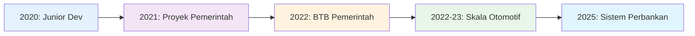
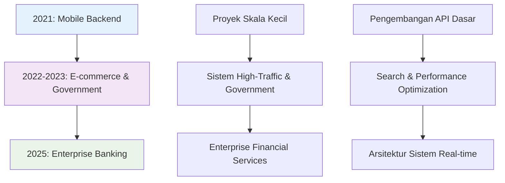

# 💼 Pengalaman Profesional
> **5+ Tahun Membangun Sistem Scalable • Perbankan → Pemerintahan → Otomotif → Fintech**

## **🚀 Trajektori Pertumbuhan Karir**

**Evolusi Karir:** Junior Developer → Spesialis Lintas Industri → Senior Performance Engineer  
**Pertumbuhan Kunci:** Kompleksitas teknis + Dampak bisnis + Tanggung jawab kepemimpinan

---

### **📊 Ringkasan Dampak Karir**

| Metrik | Pencapaian | Industri | Tahun |
|--------|------------|----------|-------|
| **Performa** | Peningkatan 87% | Otomotif | 2022-23 |
| **Kapasitas** | Peningkatan 500% | Pemerintahan | 2022-23 |
| **Efisiensi** | Pengurangan waktu 70% | Layanan Publik | 2021 |
| **Inovasi** | Arsitektur real-time | Perbankan | 2025 |

---

## 🏦 SMBC Indonesia
**Fullstack Engineer** | *Mei 2025 - Juli 2025*

### 🎯 Fokus Proyek
Berkontribusi pada transformasi digital **SMBC Indonesia** (Sumitomo Mitsui Banking Corporation Indonesia) dengan mengembangkan dan mengoptimasi sistem auto-assignment untuk layanan video call yang digunakan di berbagai channel, termasuk layanan premium **Sinaya Prioritas**.

### 🛠️ Tanggung Jawab Teknis
- **Optimasi Sistem**: Mentransformasi assignment video call berbasis polling ke arsitektur event-driven
- **Implementasi Real-time**: Mengintegrasikan Redis Stream/Sorted Set dengan WebSocket untuk notifikasi instan
- **Peningkatan Performa**: Menghilangkan overhead API polling dan meningkatkan responsivitas sistem
- **Migrasi Arsitektur**: Berhasil melakukan migrasi dari Redis Stream ke Sorted Set + Hash + Pub/Sub

### 📊 Pencapaian Utama
- ✅ Menghilangkan beban server dari API polling berulang
- ✅ Mengimplementasikan assignment panggilan berbasis prioritas sesuai aturan bisnis
- ✅ Meningkatkan pengalaman agent dan customer dengan update real-time
- ✅ Membangun arsitektur event-driven yang scalable untuk pertumbuhan masa depan

### 🔧 Technology Stack
- **Backend**: Framework internal (spesifik proyek)
- **Real-time**: Redis (Stream, Sorted Set, Hash, Pub/Sub), WebSocket
- **Arsitektur**: Event-driven, berorientasi microservices

---

## 🚗 Otoklix Indonesia
**Backend Engineer** | *Maret 2022 - Desember 2023*

### 🎯 Gambaran Perusahaan
Otoklix adalah platform digital B2C terkemuka di sektor otomotif Indonesia, menyediakan layanan komprehensif untuk perawatan kendaraan, suku cadang, dan manajemen bengkel.

### 🛠️ Proyek Utama & Kontribusi

#### **Proyek Optimasi Search Engine** *(Ags 2022 - Nov 2022)*
- **Tantangan**: Pencarian aplikasi customer memakan 15+ detik dengan relevansi buruk
- **Solusi**: Mendesain ulang dari pencarian berbasis paket ke berbasis produk menggunakan Elasticsearch
- **Dampak**: **87% peningkatan performa** (15+ detik → <2 detik)
- **Teknis**: Optimasi Elasticsearch, mengurangi dependensi MySQL, background indexing RabbitMQ

#### **Pencarian Similarity Cerdas** *(Sep 2023 - Des 2023)*
- **Tantangan**: Pencarian ERP internal terbatas pada exact match, membuat frustrasi tim CS
- **Solusi**: Pencarian similarity multi-algoritma (Cosine, Jaccard, Fuzzy matching, Spell checker)
- **Dampak**: Meningkatkan produktivitas CS dan efisiensi booking secara dramatis
- **Teknis**: Redis indexing, algoritma similarity Python, background processing

#### **Pengembangan Sistem POS** *(Mar 2023 - Jun 2023)*
- **Tantangan**: Operasi bengkel tidak terintegrasi dengan database utama Otoklix
- **Solusi**: Sistem POS berbasis web dengan integrasi ERP real-time
- **Dampak**: Manajemen inventory otomatis dan operasi bengkel yang efisien
- **Teknis**: Django backend, React frontend, sistem queue RabbitMQ

### 📊 Pencapaian Keseluruhan di Otoklix
- ✅ **Performa**: 87% peningkatan waktu respon pencarian
- ✅ **User Experience**: Meningkatkan relevansi dan kecepatan pencarian aplikasi customer
- ✅ **Efisiensi Operasional**: Meningkatkan produktivitas tim CS dengan pencarian cerdas
- ✅ **Integrasi Sistem**: Berhasil menghubungkan POS bengkel dengan sistem ERP utama

### 🔧 Technology Stack
- **Backend**: Python (Django), PHP
- **Database**: MySQL
- **Search**: Elasticsearch
- **Caching**: Redis
- **Queue**: RabbitMQ
- **Integrasi Frontend**: React.js

---

## 🏗️ BTB - Kementerian PUPR
**Freelance Software Engineer** | *Oktober 2022 - Mei 2023*

### 🎯 Fokus Proyek
Mengembangkan **BTB-Ku**, portal informasi dan aplikasi online terintegrasi untuk **Balai Teknik Bendungan (BTB)** di bawah Direktorat Jenderal Sumber Daya Air. Platform ini menyediakan akses terpadu untuk aplikasi izin terkait bendungan, sertifikasi, dan pemantauan.

### 🛠️ Tanggung Jawab Teknis
- **Arsitektur Backend**: Merancang arsitektur REST API modular menggunakan Laravel
- **Pengembangan API**: Membangun endpoint komprehensif untuk modul eSAP, SMDB, dan RECIS
- **Optimasi Performa**: Mengimplementasikan Redis caching dan background job processing
- **Desain Database**: Membuat skema MySQL efisien untuk aplikasi, dokumen, dan audit logs
- **Integrasi**: Menghubungkan API dengan portal frontend untuk alur data yang seamless

### 📊 Pencapaian Utama
- ✅ Mendigitalkan proses pemerintah manual untuk efisiensi yang lebih baik
- ✅ Mengimplementasikan caching berbasis Redis mengurangi beban database secara signifikan
- ✅ Membangun sistem background processing untuk operasi dokumen berat
- ✅ Meningkatkan transparansi dengan pelacakan status aplikasi real-time

### 🔧 Technology Stack
- **Backend**: PHP 7.x, Laravel Framework
- **Database**: MySQL
- **Caching & Queue**: Redis (caching + job queue)
- **Infrastruktur**: Web server + konfigurasi produksi

---

## 🏛️ Proyek Transformasi Digital Pemerintah
**Freelance Software Engineer** | *September 2021 - November 2021*

### 🎯 Proyek: SISDABIMA
**Klien**: DSDABMBK (Dinas Sumber Daya Air, Bina Marga & Bina Konstruksi) - Kabupaten Bekasi

### 🛠️ Tanggung Jawab Teknis
- **Arsitektur Full-Stack**: Merancang dan mengimplementasikan platform layanan digital lengkap
- **Manajemen Infrastruktur**: Setup lingkungan produksi dari Ubuntu server hingga deployment aplikasi
- **Pengembangan API**: Membangun REST API menggunakan CodeIgniter 3 untuk semua workflow layanan
- **Optimasi Performa**: Mengimplementasikan Redis untuk caching dan manajemen queue
- **Keamanan & Compliance**: Memastikan sistem memenuhi persyaratan keamanan dan regulasi pemerintah

### 📊 Pencapaian Utama
- ✅ **70% pengurangan waktu** pemrosesan layanan (7-14 hari → 2-4 hari)
- ✅ **500% peningkatan kapasitas** (±100 → >500 aplikasi/bulan)
- ✅ **Fondasi hukum**: Didukung oleh Peraturan Bupati Bekasi No. 64 Tahun 2021
- ✅ **Digitalisasi lengkap** proses pemerintah yang sebelumnya manual

### 🔧 Technology Stack
- **Backend**: PHP 7.3, CodeIgniter 3 (REST API)
- **Frontend**: Bootstrap 3
- **Database**: MySQL
- **Infrastruktur**: Ubuntu Server, Apache Web Server
- **Performa**: Redis (sistem caching + queue)

---

## 📱 PT TOGU Inovasi Teknologi
**Backend & Deployment Specialist** | *April 2021 - September 2021*

### 🎯 Gambaran Perusahaan
PT TOGU Inovasi Teknologi fokus pada pengembangan aplikasi mobile konsumen inovatif sebagai bagian dari inisiatif "Hundred Apps Project".

### 🛠️ Proyek Utama

#### **SMOP (Smart Shopping List)** *(Apr 2021 - Jun 2021)*
- **Peran**: Backend & Deployment Specialist
- **Tantangan**: Koordinasi belanja keluarga dan manajemen list
- **Solusi**: Aplikasi belanja kolaboratif dengan sinkronisasi real-time
- **Teknis**: Integrasi Firebase FCM, Google Drive API untuk kolaborasi real-time
- **Infrastruktur**: Arsitektur backend lengkap, manajemen server, deployment

#### **Platform Komunikasi Wello** *(Jul 2021 - Sep 2021)*
- **Peran**: Backend & Real-Time Communication Engineer
- **Tantangan**: Aplikasi komunikasi multi-protokol (chat, voice, video, push-to-talk)
- **Solusi**: Mengintegrasikan XMPP dan WebRTC untuk komunikasi komprehensif
- **Teknis**: WebSocket signaling server, real-time messaging, voice/video calls

### 📊 Kontribusi Utama
- ✅ **Kolaborasi Real-time**: Berhasil mengimplementasikan sharing daftar belanja keluarga
- ✅ **Solusi Multi-platform**: Aplikasi Flutter dengan backend API yang robust
- ✅ **Integrasi Kompleks**: Firebase, Google Drive, XMPP, WebRTC
- ✅ **Infrastruktur Lengkap**: Setup server, deployment, dan maintenance komplet

### 🔧 Technology Stack
- **Backend**: PHP 7, CodeIgniter 3
- **Mobile**: Flutter (Android & iOS)
- **Database**: MySQL
- **Real-time**: WebSocket, XMPP, WebRTC
- **Cloud Services**: Firebase FCM, Google Drive API
- **Infrastruktur**: Linux Ubuntu Server, Apache

---

## 🎯 Progres & Pertumbuhan Karier

---

## 🏆 Sorotan Profesional

### **Penguasaan Teknis**
- **5+ tahun** pengalaman pengembangan backend progresif
- **Multiple industries**: Fintech, otomotif, pemerintah, aplikasi mobile
- **Optimasi performa**: Konsisten menghasilkan peningkatan 70-87%
- **Kemampuan full-stack**: Dari database hingga deployment

### **Dampak Proyek**
- **Digitalisasi pemerintah**: Mentransformasi proses manual yang memengaruhi ribuan warga
- **Sistem enterprise**: Mengoptimasi operasi customer service perbankan
- **Aplikasi konsumen**: Meningkatkan user experience untuk platform high-traffic
- **Sistem real-time**: Membangun platform komunikasi dan assignment yang scalable

### **Leadership Teknis**
- **Desain arsitektur**: Menciptakan arsitektur sistem yang scalable dan maintainable
- **Riset teknologi**: Mengevaluasi dan mengimplementasikan solusi teknologi optimal
- **Manajemen infrastruktur**: Setup server dan deployment produksi lengkap
- **Kolaborasi lintas fungsi**: Bekerja efektif dengan tim yang beragam

---

*Setiap peran telah membangun pengalaman sebelumnya, menciptakan pemahaman komprehensif tentang sistem backend di berbagai skala, industri, dan tantangan teknis.*
