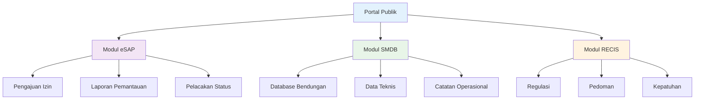

# 🏗️ BTB-Ku Manajemen Bendungan
> Platform transformasi digital terintegrasi untuk manajemen bendungan dan sumber daya air Indonesia

---

## 🎯 Gambaran Proyek

**Durasi:** Oktober 2022 - Mei 2023  
**Peran:** Freelance Software Engineer (Backend Developer)  
**Klien:** Balai Teknik Bendungan (BTB) - Direktorat Jenderal SDA, Kementerian PUPR

**BTB-Ku** adalah portal layanan informasi dan permohonan online terpadu milik **Balai Teknik Bendungan (BTB)** di bawah Direktorat Jenderal Sumber Daya Air, Kementerian PUPR. Portal ini menyediakan akses terpadu untuk pengajuan izin, sertifikasi, dan pemantauan terkait bendungan dan waduk.

🔗 **Sistem Live:** [btbku.sda.pu.go.id](https://btbku.sda.pu.go.id/)

---

## 🚀 Tantangan yang Dihadapi

<strong>Masalah Sistem Manual & Terfragmentasi</strong>

Sebelum implementasi portal terpadu, proses administrasi dan pelaporan terkait bendungan umumnya bersifat manual, tersebar di berbagai unit, dan memerlukan koordinasi lintas-instansi yang rumit:

- **Fragmentasi Informasi** - Dokumen perizinan, laporan pemantauan, dan data teknis tersebar
- **Kepatuhan Regulasi** - Banyak prosedur yang harus sesuai Peraturan Menteri terkait bendungan
- **Akses & Transparansi** - Pemohon dan pemangku kepentingan memerlukan cara yang lebih mudah untuk mengajukan permohonan dan memantau statusnya secara elektronik

---

## 💡 Solusi: Platform BTB-Ku

Portal **BTB-Ku** dirancang sebagai titik layanan terpadu untuk mengatasi tantangan tersebut dengan menyediakan alur digital terstruktur untuk berbagai jenis permohonan, dokumentasi, dan pemantauan.

### 🔧 Fitur & Kemampuan Utama

#### **eSAP (Elektronik Sertifikasi dan Pemantauan)**
- Pengajuan dan pengelolaan digital untuk persetujuan desain, izin konstruksi, izin pengisian awal waduk, izin operasi, penghapusan fungsi
- Penyampaian laporan pemantauan berkala sesuai pedoman Kementerian
- Pengguna dapat melihat persyaratan administratif dan teknis untuk setiap jenis permohonan

#### **SMDB (Sistem Management Database Bendungan)**
- Penyimpanan dan pengelolaan database teknis bendungan
- Penyimpanan data inventaris, sejarah pemeriksaan, dan data operasional bendungan

#### **RECIS**
- Penguatan izin/sertifikasi elektronik dan pedoman
- Memperkuat fungsi elektronifikasi permohonan dan pemantauan

#### **Kontak & Bantuan**
- Informasi kontak kantor BTB (email dan nomor telepon)
- Jam operasional layanan tersedia di portal untuk dukungan pengguna

---

## 🛠️ Kontribusi Teknis Saya

### Peran Backend Developer (Penyedia API & Infrastruktur)

Sebagai salah satu developer eksekutor yang berkontribusi pada pengembangan BTB-Ku—khususnya untuk layanan **eSAP, SMDB, dan RECIS**—tanggung jawab teknis saya mencakup:

#### 1. **Arsitektur Backend & Desain API**
- Merancang arsitektur backend modular berbasis REST API untuk mendukung decoupling antara frontend portal dan layanan backend
- Menyusun kontrak API (endpoints, request/response schema, validasi) untuk: pengajuan permohonan, unggah dokumen, otorisasi pengguna, pelacakan status permohonan, manajemen master data bendungan, dan laporan pemantauan

#### 2. **Implementasi & Integrasi**
- Mengimplementasikan semua endpoint backend menggunakan **PHP 7 (Laravel)** memastikan standar keamanan (auth, role-based access), validasi dokumen, dan ketersediaan API untuk integrasi antar-modul
- Mengintegrasikan API dengan modul frontend portal (form pengajuan, dashboard pemantauan, halaman persyaratan) untuk alur data end-to-end yang konsisten

#### 3. **Performa, Caching & Background Processing**
- Menggunakan **Redis** untuk caching data read-heavy (data master bendungan, daftar persyaratan) untuk mengurangi beban query MySQL dan mempercepat respons
- Memanfaatkan Redis sebagai **broker untuk background task & queue** - validasi dokumen besar, konversi/scan file, notifikasi email, dan pembuatan laporan berkala dijalankan asinkron agar request pengguna tetap responsif

#### 4. **Database & Keandalan**
- Merancang skema database **MySQL** untuk menyimpan data permohonan, histori status, metadata dokumen, dan log audit
- Menerapkan migrasi dan seed database yang rapi (Laravel migrations & seeders) untuk mempermudah deployment/rollback

#### 5. **Deployment & Operasional** (kolaborasi tim infrastruktur)
- Bekerja sama dengan tim infrastruktur untuk pipeline deployment (CI/CD), konfigurasi lingkungan produksi, pengaturan connection pooling DB, dan pengamanan endpoint API (rate limiting, input sanitization)

---

## 📊 Hasil & Dampak

| Metrik/Area | Sebelum (Manual/Terfragmentasi) | Sesudah (BTB-Ku) |
|-------------|--------------------------------|------------------|
| **Metode Pengajuan** | Manual & tatap muka | **Elektronik via eSAP/portal BTB-Ku** |
| **Akses Data & Transparansi** | Terbatas | **Lebih mudah, terpusat, pengguna dapat melihat status permohonan** |
| **Efisiensi Proses** | Lambat, bergantung proses manual | **Lebih cepat (API + background jobs), notifikasi otomatis** |
| **Keandalan Operasional** | Sulit distandarisasi | **Lebih terstruktur: DB terpusat, cache, job queue untuk tugas berat** |

---

## 🔧 Technology Stack

- **Backend:** PHP 7.x, Laravel (berbasis REST API)
- **Frontend:** Integrasi portal (portal publik)
- **Database:** MySQL
- **Caching & Queue Broker:** Redis (caching + job queue)
- **Penyimpanan Dokumen:** Object storage/file server (dikonfigurasi sesuai kebijakan institusi)
- **Infrastruktur & Operasional:** Web server + konfigurasi produksi (kolaborasi dengan tim infra/ops)

---

## 🎉 Pencapaian Utama

✅ **Transformasi Digital** - Mengkonversi proses manual menjadi alur kerja elektronik  
✅ **Portal Terpadu** - Mengintegrasikan berbagai layanan (eSAP, SMDB, RECIS) dalam satu platform  
✅ **Optimasi Performa** - Mengimplementasikan Redis caching dan background job processing  
✅ **Kepatuhan Regulasi** - Memastikan kepatuhan terhadap regulasi dan pedoman Kementerian  
✅ **Transparansi Enhanced** - Pelacakan status permohonan real-time untuk pengguna  
✅ **Arsitektur Scalable** - Desain modular yang mendukung ekspansi masa depan  

---

*Sistem ini berhasil memodernisasi layanan manajemen bendungan di Indonesia, menyediakan akses digital yang efisien, transparan, dan terpusat untuk semua pemangku kepentingan yang terlibat dalam konstruksi, operasi, dan pemeliharaan bendungan.*
