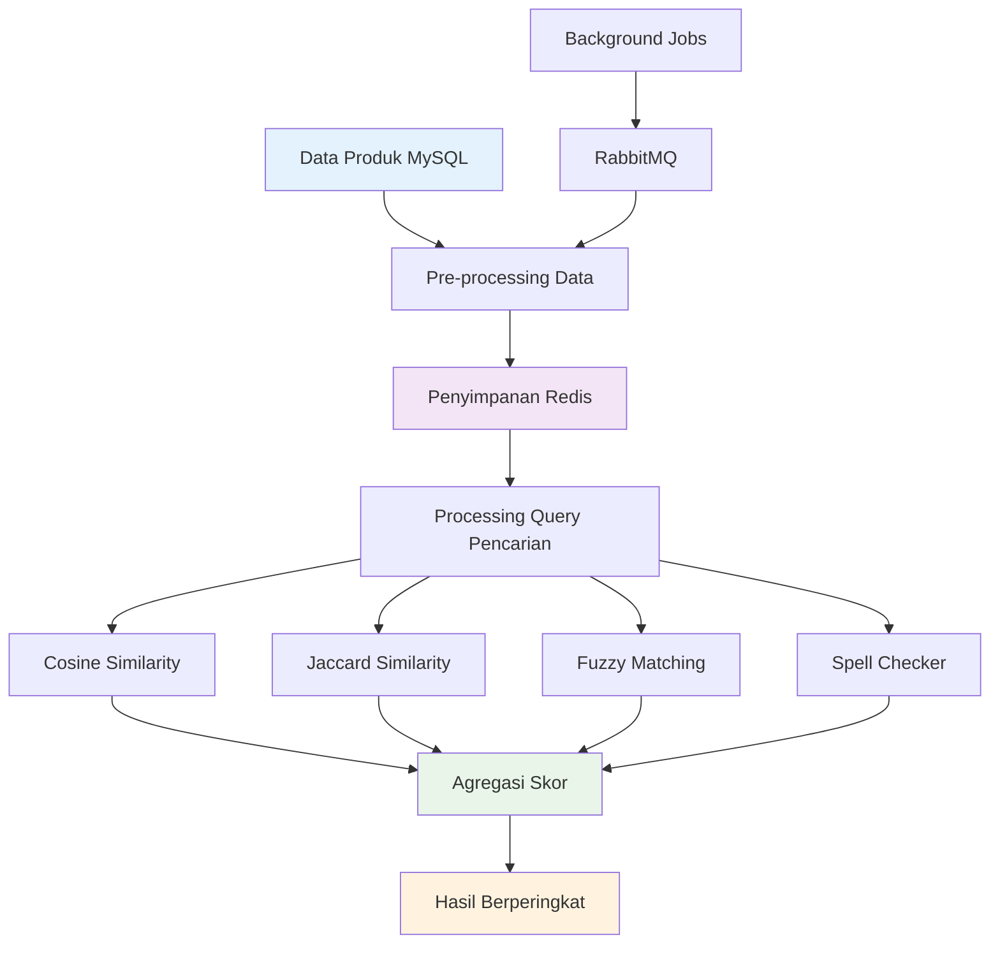
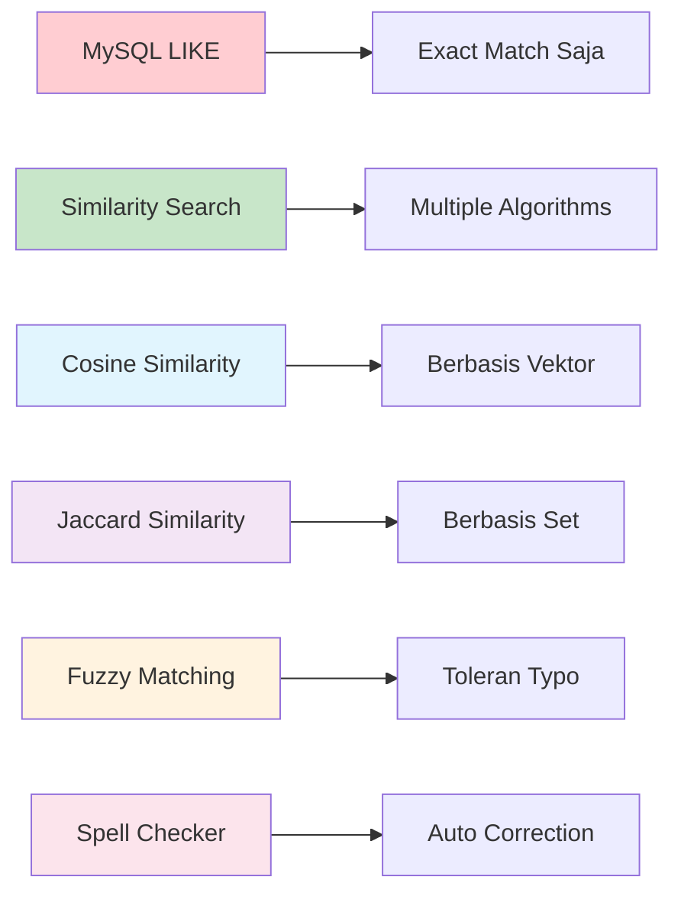
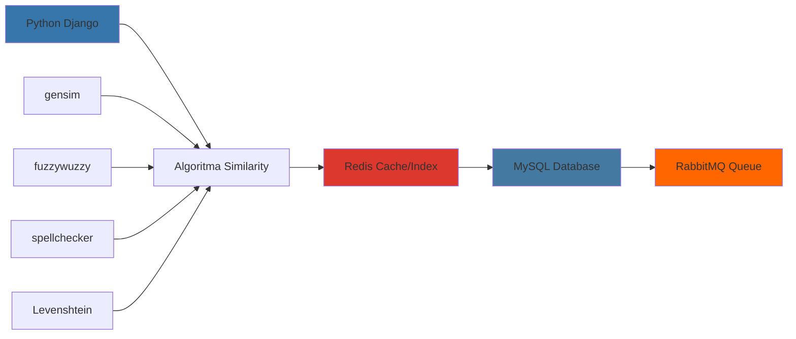

# 🧠 Sistem Pencarian Similarity Cerdas
> Optimasi pencarian produk dan servis lanjutan untuk tools ERP internal

---

## 🎯 Gambaran Proyek

**Durasi:** September 2023 - Desember 2023  
**Peran:** Backend Engineer  
**Perusahaan:** Otoklix Indonesia

Proyek ini berfokus pada **optimasi sistem pencarian produk dan servis** di aplikasi internal ERP Otoklix. Sistem ini digunakan oleh tim **Customer Service (CS)** untuk melakukan booking produk dan layanan melalui internal tools.

Sebelumnya, sistem pencarian masih menggunakan pendekatan sederhana dengan *LIKE query* di MySQL, sehingga hasil pencarian terbatas, tidak toleran terhadap typo, dan seringkali gagal menemukan produk yang relevan.

Sebagai **Backend Engineer**, saya bertanggung jawab untuk meneliti teknologi yang tepat, mendesain arsitektur pencarian, membangun pipeline data, hingga mengembangkan algoritma *similarity search* agar sistem pencarian lebih akurat dan efisien.

---

## 🚀 Tantangan yang Dihadapi

<strong>Keterbatasan Sistem Pencarian Legacy</strong>

Sebelum adanya optimasi ini, sistem pencarian menghadapi beberapa kendala besar:

- **Keterbatasan Pencarian:** Query menggunakan `LIKE` MySQL hanya bisa menemukan data jika penulisan sama persis. Contoh: mencari `oli shell helix hx6` dengan input `shell hx6` tidak mengembalikan hasil apapun
- **Tidak Toleran Typo:** CS sering salah ketik atau tidak menuliskan nama produk secara lengkap
- **Efisiensi Proses Booking Rendah:** CS membutuhkan waktu lebih lama untuk menemukan produk, memperlambat proses booking pelanggan
- **Keterbatasan Infrastruktur:** Karena adanya kebijakan efisiensi biaya, tidak memungkinkan untuk menambah layanan baru seperti Elasticsearch atau MongoDB

---

## 💡 Solusi: Implementasi Sistem Similarity Search Cerdas

Untuk mengatasi kendala tersebut, saya membangun sistem **similarity search sederhana** berbasis Python dengan kombinasi berbagai algoritma pencarian teks.

### 🔧 Fitur & Kemampuan Utama

#### **Similarity Search Berlapis**
Query pengguna diproses terlebih dahulu, lalu dibandingkan dengan data produk menggunakan:
- **Cosine Similarity** - Perbandingan teks berbasis vektor
- **Jaccard Similarity** - Pengukuran kesamaan berbasis set
- **Fuzzy Matching** - (*fuzzywuzzy*, *Levenshtein distance*) untuk toleransi typo
- **Spell Checker** - Koreksi kata otomatis

#### **Pre-processing Data Produk**
- Data produk dari MySQL diproses dan disimpan di Redis dalam bentuk hash (key = product_id, value = atribut produk untuk pencarian)
- Struktur data yang dioptimalkan untuk kalkulasi similarity cepat

#### **Agregasi Hasil**
- Skor dari beberapa algoritma digabungkan dan diurutkan berdasarkan tingkat kesamaan tertinggi
- Sistem pembobotan untuk hasil yang seimbang

#### **Phase 2: Optimasi Indexing**
- Menambahkan sistem indexing di Redis untuk mempercepat pencarian
- Index dibangun berdasarkan kata-kata di nama produk, sehingga hanya subset data relevan yang dibandingkan

---

## 🛠️ Kontribusi Teknis Saya

### Peran Backend Engineer

Sebagai penanggung jawab utama backend, saya memegang peran kunci dalam:

#### 1. **Research & Desain Solusi**
- Melakukan riset mendalam terkait teknologi similarity search yang efisien tanpa menambah biaya infrastruktur
- Menyusun desain arsitektur pipeline pencarian yang kompatibel dengan stack ERP Otoklix

#### 2. **Pengembangan Backend**
- Membuat *background process* untuk pre-processing data produk menggunakan **RabbitMQ**
- Menyediakan REST API untuk pencarian produk dan servis
- Mengimplementasikan algoritma similarity search dengan **gensim, fuzzywuzzy, spellchecker, dan python-Levenshtein**

#### 3. **Optimasi & Indexing**
- Mengurangi response time dengan indexing di Redis, sehingga pencarian lebih cepat meskipun data produk semakin besar
- Melakukan benchmarking performa antara Phase 1 dan Phase 2 untuk memastikan peningkatan signifikan

---

## 📊 Perbandingan Performa Algoritma

## 📊 Hasil & Dampak

Optimasi sistem pencarian memberikan dampak signifikan terhadap produktivitas tim CS dan efisiensi proses booking:

| Metrik | Sebelum Optimasi | Sesudah Optimasi |
|--------|------------------|------------------|
| **Akurasi Pencarian** | Rendah, bergantung pada input persis | **Tinggi, toleran typo & variasi nama** |
| **Kecepatan Respon** | Lama (full scan data) | **Lebih cepat berkat indexing Redis** |
| **Produktivitas CS** | Sering terhambat mencari produk | **Lebih efisien, booking lebih cepat** |
| **Pengalaman Pengguna Internal** | Frustasi, sering gagal menemukan produk | **Lebih nyaman & memuaskan** |

---

## 🔧 Technology Stack

Melanjutkan stack utama ERP Otoklix:

- **Backend:** Python (Django Framework)
- **Database:** MySQL
- **Caching & Indexing:** Redis
- **Message Queue:** RabbitMQ (background pre-processing)
- **Web Server:** Nginx
- **Frontend:** React.js (ERP Internal Otoklix)

---

## 🎉 Pencapaian Utama

✅ **Intelligent Search** - Mengubah exact match menjadi pencarian berbasis similarity cerdas  
✅ **Toleransi Typo** - Membangun fuzzy matching dan spell checking yang robust  
✅ **Optimasi Performa** - Mengimplementasikan Redis indexing untuk hasil lebih cepat  
✅ **Solusi Cost-Effective** - Mencapai pencarian advanced tanpa infrastruktur baru  
✅ **Enhanced Productivity** - Meningkatkan efisiensi tim CS secara signifikan  
✅ **Arsitektur Scalable** - Desain modular yang mendukung peningkatan algoritma masa depan  

---

## 💡 Insights Teknis

Proyek ini memberikan pembelajaran mendalam dalam:
- **Algoritma Text Similarity** dan aplikasi praktisnya
- **Optimasi Pencarian** tanpa infrastruktur mahal
- **Struktur Data Redis** untuk indexing dan caching yang efisien
- **Kombinasi Algoritma** untuk hasil pencarian yang lebih baik
- **Performance Benchmarking** untuk peningkatan yang terukur

---

## 🔬 Detail Algoritma

<strong>Implementasi Similarity Search</strong>

**Phase 1: Similarity Dasar**
- Cosine similarity untuk semantic matching
- Jaccard similarity untuk token overlap
- Fuzzy matching untuk toleransi typo

**Phase 2: Optimasi dengan Indexing**
- Redis-based word indexing
- Subset matching untuk performa
- Kombinasi pembobotan skor

**Background Processing**
- Preprocessing data otomatis
- Update index real-time
- Arsitektur berbasis queue

---

*Secara keseluruhan, optimasi ini berhasil mengubah sistem pencarian dari sekadar *exact match* menjadi **intelligent search** yang lebih akurat, efisien, dan ramah pengguna.*
