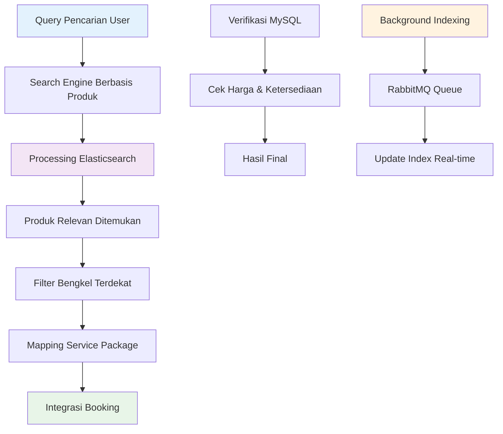
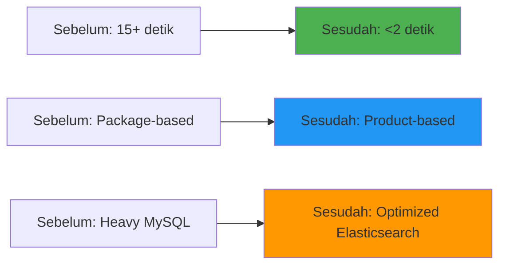

# 🔍 Optimasi Search Engine Otoklix
> Proyek peningkatan performa dan relevansi pencarian aplikasi customer

---

## 🎯 Gambaran Proyek

**Durasi:** Agustus 2022 - November 2022  
**Peran:** Backend Engineer  
**Perusahaan:** Otoklix Indonesia

Sebagai salah satu layanan B2C utama di sektor otomotif, **Otoklix** menyediakan platform digital untuk pemesanan produk dan layanan bengkel. Namun, fitur pencarian pada aplikasi customer (*CustApp*) masih menghadapi kendala besar, baik dari sisi performa maupun relevansi hasil pencarian.

Melalui proyek ini, saya bertanggung jawab melakukan **optimasi sistem pencarian** dengan memanfaatkan **Elasticsearch**, transformasi struktur data, dan perbaikan alur backend. Hasilnya adalah sistem pencarian yang lebih cepat, relevan, dan efisien yang secara signifikan meningkatkan user experience.

---

## 🚀 Tantangan yang Dihadapi

<strong>Keterbatasan Sistem Pencarian Legacy</strong>

Sebelum optimasi dilakukan, fitur pencarian menghadapi beberapa masalah kritis:

- **Pencarian Berbasis Paket:** Sistem pencarian masih berbasis *service package*, sehingga hasil kurang relevan ketika pengguna mencari produk atau layanan tertentu
- **Performa Rendah:** Waktu respon pencarian bisa mencapai lebih dari **15 detik**, jauh dari standar ideal untuk user experience
- **Beban Query Berat:** Meskipun sudah menggunakan Elasticsearch, backend masih melakukan proses kalkulasi harga yang panjang dengan banyak query tambahan ke MySQL, sehingga proses menjadi lambat
- **Kompleksitas Berlebih:** Karena berbasis paket, pencarian membutuhkan query MySQL kompleks untuk setiap hasil, membuat sistem sulit dioptimalkan

---

## 💡 Solusi: Optimasi Sistem Pencarian Menyeluruh

Untuk mengatasi tantangan tersebut, saya melakukan pendekatan menyeluruh dalam desain ulang sistem pencarian.

### 🔧 Fitur & Kemampuan Utama

#### **Peralihan dari Package-Based ke Product-Based Search**
- Transformasi pencarian agar fokus pada produk (jenis, brand, tipe), lalu menurunkan hasil ke paket servis dan bengkel yang relevan
- Pengalaman pencarian yang lebih intuitif dan relevan bagi pengguna

#### **Optimasi Elasticsearch**
- Mendesain ulang struktur dokumen dan indeks Elasticsearch
- Menyimpan lebih banyak data yang siap pakai di Elasticsearch untuk mengurangi ketergantungan pada MySQL

#### **Pencarian Terintegrasi & Sederhana**
Kini pengguna cukup melalui **1 endpoint pencarian** untuk:
1. Cari produk
2. Pilih bengkel terdekat yang menyediakan produk/paket
3. Pilih paket servis
4. Lakukan booking

#### **Minim Query MySQL**
Query ke MySQL hanya dilakukan untuk verifikasi akhir seperti ketersediaan produk dan harga terbaru agar data tetap akurat

---

## 🛠️ Kontribusi Teknis Saya

### Peran Backend Engineer

Dalam proyek ini, saya berperan penuh pada sisi backend dengan tanggung jawab utama:

#### 1. **Research & Desain Teknologi**
- Menganalisis kelemahan arsitektur pencarian sebelumnya
- Melakukan riset referensi terbaik dalam implementasi Elasticsearch untuk pencarian produk dan layanan
- Mendesain ulang struktur data dan alur pencarian

#### 2. **Pengembangan & Integrasi**
- Menyusun ulang dokumen dan indeks Elasticsearch agar sesuai dengan model pencarian berbasis produk
- Menyediakan REST API baru yang lebih ringkas, cepat, dan mudah digunakan frontend
- Memastikan aliran data dari backend ke frontend lebih efisien tanpa beban query berlebih

#### 3. **Optimasi Performa Sistem**
- Mengurangi dependency query ke MySQL dengan menaruh data yang siap pakai di Elasticsearch
- Mengintegrasikan **RabbitMQ** untuk menangani *background indexing* setiap kali ada perubahan data produk/bengkel dari ERP
- Melakukan benchmark dan uji performa hingga waktu respon pencarian berkurang drastis

---

## 📊 Hasil & Dampak

Implementasi optimasi pencarian menghasilkan peningkatan yang signifikan:

| Metrik | Sebelum Optimasi | Sesudah Optimasi |
|--------|------------------|------------------|
| **Model Pencarian** | Package-Based | **Product-Based & Terintegrasi** |
| **Waktu Respon** | > 15 detik | **< 2 detik** |
| **Relevansi Hasil** | Rendah | **Tinggi (berdasarkan produk, paket, dan lokasi)** |
| **Efisiensi Query** | Banyak Query ke MySQL | **Minim Query (lebih banyak di Elasticsearch)** |

---

## 🔧 Technology Stack

- **Backend:** Python (Django Framework)
- **Database:** MySQL
- **Search Engine:** Elasticsearch
- **Message Queue & Background Jobs:** RabbitMQ (untuk update indeks Elasticsearch)

---

## 🎉 Pencapaian Utama

✅ **87% Peningkatan Performa** - Waktu respon turun dari 15+ detik ke <2 detik  
✅ **Enhanced Search Relevance** - Pencarian berbasis produk dengan integrasi lokasi dan layanan  
✅ **Reduced Server Load** - Meminimalkan query MySQL melalui optimasi Elasticsearch  
✅ **Scalable Architecture** - Sistem background indexing untuk update data real-time  
✅ **Improved User Experience** - Single endpoint untuk alur search-to-booking lengkap  
✅ **System Reliability** - Robust error handling dan mekanisme fallback  

---

## 💡 Insights Teknis

Proyek ini memberikan pembelajaran berharga dalam:
- **Arsitektur Elasticsearch** untuk kebutuhan pencarian kompleks
- **Strategi Denormalisasi Data** untuk optimasi performa
- **Background Processing Patterns** untuk update search index real-time
- **API Design** untuk integrasi frontend yang seamless
- **Performance Benchmarking** dan teknik optimasi

---

*Secara keseluruhan, proyek ini berhasil meningkatkan **user experience** aplikasi Otoklix, memperkuat kecepatan dan relevansi pencarian, serta mendukung pertumbuhan layanan B2C di industri otomotif digital.*
