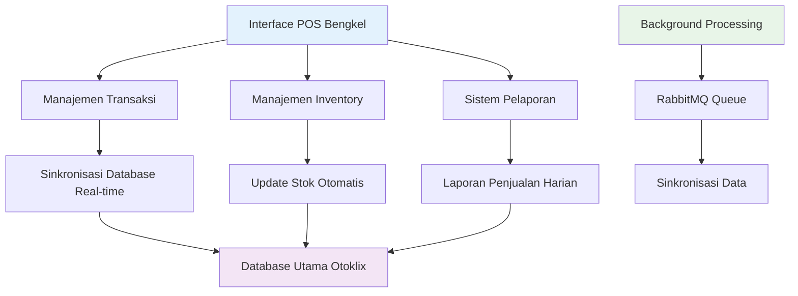
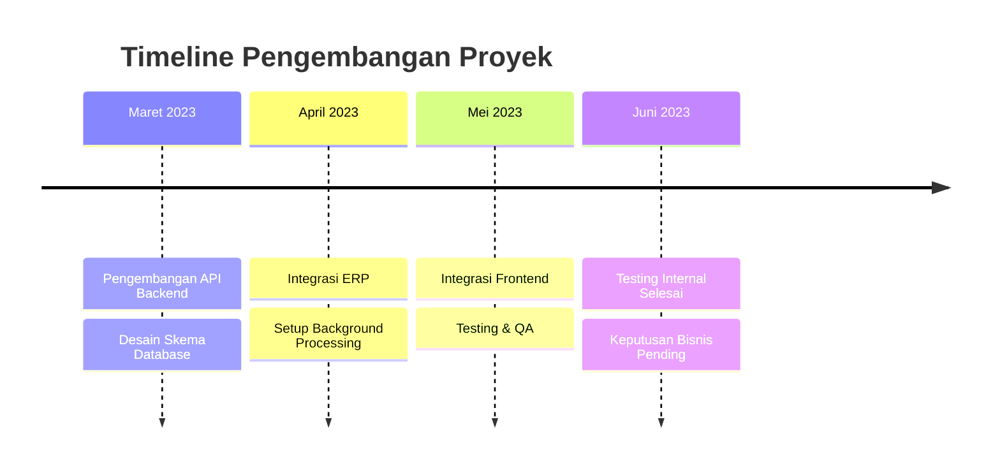
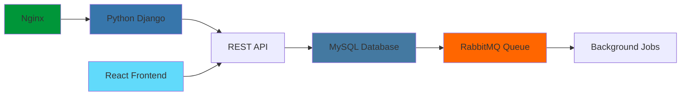

# 🛒 Sistem POS Otoklix (GMS)
> Sistem Point of Sales terintegrasi untuk manajemen bengkel otomotif

---

## 🎯 Gambaran Proyek

**Durasi:** Maret 2023 - Juni 2023  
**Peran:** Backend Engineer  
**Perusahaan:** Otoklix Indonesia

**Aplikasi POS Otoklix** adalah sistem berbasis web yang saya kembangkan sebagai bagian dari inisiatif digitalisasi di ekosistem Otoklix. Proyek ini bertujuan menyediakan solusi kasir modern untuk bengkel-bengkel yang terintegrasi langsung dengan **database utama Otoklix**, memungkinkan manajemen transaksi dan inventori real-time dengan efisiensi yang ditingkatkan.

---

## 🚀 Tantangan yang Dihadapi

<strong>Masalah Operasional Bengkel Pra-Digital</strong>

Sebelum adanya aplikasi POS ini, bengkel-bengkel dalam ekosistem Otoklix menghadapi kendala operasional yang signifikan:

- **Integrasi Terbatas:** Sistem penjualan di bengkel belum terhubung langsung dengan database utama Otoklix, menyebabkan keterlambatan sinkronisasi data
- **Inventory Manual:** Manajemen stok dilakukan secara manual, rentan terhadap keterlambatan update dan kesalahan pencatatan
- **Keterpisahan Sistem:** Belum ada sistem tunggal untuk mengelola transaksi, inventory, dan laporan secara terintegrasi
- **Efisiensi Operasional Rendah:** Tanpa digitalisasi, laporan keuangan dan stok barang memakan banyak waktu untuk dikompilasi

---

## 💡 Solusi: Aplikasi POS Otoklix Terintegrasi

Untuk mengatasi tantangan tersebut, saya berkolaborasi dengan tim mengembangkan **aplikasi POS berbasis web** yang dapat digunakan langsung di bengkel-bengkel mitra Otoklix.

### 🔧 Fitur & Kemampuan Utama

#### **Integrasi Database Real-Time**
- Seluruh transaksi terhubung langsung dengan database utama Otoklix
- Sinkronisasi data penjualan instan di seluruh ekosistem

#### **Manajemen Inventory Otomatis**
- Stok terupdate otomatis setiap ada transaksi penjualan
- Pelacakan dan manajemen inventory real-time

#### **Fitur POS Standar**
- Input transaksi penjualan
- Cetak struk
- Laporan penjualan harian
- Kompilasi data transaksi untuk analisis bisnis

#### **Arsitektur Berbasis Web**
- Aplikasi dapat diakses melalui browser tanpa perlu instalasi tambahan di perangkat kasir
- Kompatibilitas lintas platform dan deployment mudah

---

## 🛠️ Kontribusi Teknis Saya

### Peran Backend Engineer

Pada proyek ini saya memegang tanggung jawab penuh untuk **pengembangan backend**.

#### 1. **Penyediaan REST API**
Saya mengembangkan berbagai **endpoint API** yang digunakan oleh aplikasi POS, meliputi:
- API transaksi penjualan
- API manajemen inventory
- API laporan keuangan dan transaksi harian

#### 2. **Integrasi Sistem ERP**
Saya merancang backend agar terhubung langsung dengan database ERP Otoklix, memungkinkan manajemen inventory yang sebelumnya manual kini dapat **sinkron otomatis** dengan transaksi POS.

#### 3. **Background Processing**
Menggunakan **RabbitMQ**, saya menyiapkan sistem queue untuk menangani proses background, seperti sinkronisasi data berskala besar atau laporan periodik.

---

## 📊 Hasil & Status Proyek

Meskipun proyek ini berhasil dibangun hingga tahap testing internal, aplikasi POS Otoklix **belum sempat rilis ke production** karena pertimbangan dan faktor bisnis di sisi perusahaan.

Namun, dari sisi teknis, aplikasi ini telah menunjukkan:

| Metrik | Sebelum POS Otoklix | Setelah POS Otoklix (Testing Internal) |
|--------|--------------------|------------------------------------|
| **Integrasi Data** | Terpisah, update manual | **Otomatis & real-time** |
| **Manajemen Inventory** | Manual & rentan error | **Terintegrasi dengan transaksi** |
| **Pelaporan** | Kompilasi manual | **Digital & instan** |

---

## 🔧 Technology Stack

- **Backend:** Python (Django Framework)
- **Frontend:** React.js (Web-based POS UI)
- **Database:** MySQL
- **Message Broker/Background Process:** RabbitMQ
- **Web Server & Infrastructure:** Nginx

---

## 🎉 Pencapaian Utama

✅ **Integrasi Real-time** - Menghubungkan operasi bengkel dengan database utama Otoklix  
✅ **Inventory Otomatis** - Menghilangkan kesalahan manajemen stok manual  
✅ **Background Processing** - Mengimplementasikan sistem queue scalable untuk operasi berat  
✅ **Arsitektur API-First** - Membangun fondasi REST API yang robust  
✅ **Kompatibilitas Lintas Platform** - Solusi berbasis web dapat diakses dari perangkat apapun  
✅ **Integrasi ERP** - Berhasil terhubung dengan sistem ERP Otoklix yang ada  

---

## 💡 Learning Teknis

Proyek ini menjadi fondasi penting untuk memahami:
- **Pola Integrasi Sistem ERP** dan best practices
- **Background job processing** dengan message queues
- **Tantangan sinkronisasi data real-time** dan solusinya
- **Desain API** untuk workflow bisnis yang kompleks
- **Kebutuhan digitalisasi bengkel** dan constraint-nya

---

*Proyek ini menjadi pijakan awal penting untuk pengembangan sistem ERP dan digitalisasi operasional bengkel di Otoklix, mendemonstrasikan kelayakan teknis solusi POS terintegrasi real-time.*
