# 🏛️ SISDABIMA Transformasi Digital
> Platform revolusioner layanan publik digital untuk manajemen sumber daya air

---

## 🎯 Gambaran Proyek

**Durasi:** September 2021 - November 2021  
**Peran:** Freelance Software Engineer (Arsitek, Backend Developer & Technical Lead)  
**Klien:** DSDABMBK (Dinas Sumber Daya Air, Bina Marga & Bina Konstruksi) - Kabupaten Bekasi

**SISDABIMA (Sistem Pelayanan Sumber Daya Air dan Bina Marga)** adalah aplikasi berbasis web yang saya kembangkan untuk merevolusi sistem pelayanan di **Dinas Sumber Daya Air, Bina Marga, dan Bina Konstruksi (DSDABMBK) Kabupaten Bekasi**.

Proyek ini mentransformasikan layanan yang sebelumnya **100% manual** menjadi sistem digital terintegrasi, sehingga **waktu pemrosesan layanan turun hingga 70%** dan masyarakat bisa melacak status permohonan secara *real-time*.

🎥 **Demo Proyek:** [Video YouTube](https://www.youtube.com/watch?v=u0F0eP5Znsc)

---

## 🚀 Tantangan yang Dihadapi

<strong>Masalah Sistem Layanan Manual</strong>

Sebelum adanya SISDABIMA, DSDABMBK menghadapi tantangan besar:

- **Proses Manual:** Seluruh alur permohonan dilakukan tatap muka dan berbasis dokumen fisik
- **Waktu Layanan Lama:** Rata-rata proses memakan **7–14 hari kerja**
- **Kurang Transparan:** Pemohon tidak dapat melacak status permohonan mereka
- **Minim Legitimasi Digital:** Belum ada payung hukum untuk layanan elektronik

Hal ini menimbulkan **beban administrasi tinggi**, keterlambatan layanan, dan menurunkan kepuasan masyarakat.

---

## 💡 Solusi: Platform Digital SISDABIMA

Sebagai jawaban, saya mengembangkan **platform digital terpadu** dengan alur pelayanan end-to-end yang terdigitalisasi.

### 🔧 Fitur & Kemampuan Utama

#### **Pelayanan Online Terpadu**
- Masyarakat dapat mengajukan permohonan layanan dari mana saja, 24/7
- Alur kerja digital penuh dari pengajuan → verifikasi → penjadwalan → penerbitan dokumen hasil

#### **Transparansi Proses**
- Pemohon bisa melacak status secara *real-time*
- Sistem notifikasi otomatis untuk update status

#### **Dasar Hukum yang Kuat**
- Operasional sistem didukung **Peraturan Bupati Bekasi No. 64 Tahun 2021**
- Sepenuhnya sesuai dengan persyaratan layanan digital pemerintah daerah

#### **Layanan Prioritas**
- Fase awal fokus pada **penanganan banjir** dan **uji material beton**
- Dua kebutuhan paling krusial yang diidentifikasi di lapangan

---

## 🛠️ Kontribusi Teknis Saya

### Arsitek, Backend Developer & Technical Lead

Saya menangani siklus pengembangan teknis lengkap, dari desain arsitektur hingga deployment produksi.

Saya menjadi penanggung jawab teknis utama, dari perancangan arsitektur hingga deployment di produksi.

#### 1. **Perancangan Arsitektur & Pemilihan Teknologi**
- Merancang arsitektur berbasis **REST API** meski menggunakan CodeIgniter 3, untuk memisahkan backend & frontend serta membuka peluang integrasi di masa depan
- Memilih **Redis** bukan hanya untuk *caching*, tapi juga sebagai **queue system** agar aplikasi tetap responsif di bawah beban tinggi

#### 2. **Pengembangan Backend & Integrasi**
- Membangun seluruh **REST API endpoint**: autentikasi, manajemen data master, hingga logika bisnis layanan
- Mengintegrasikan API dengan frontend berbasis Bootstrap agar data mengalir lancar sesuai desain UX
- Memastikan hasil uji coba *end-to-end* sesuai kebutuhan dinas & regulasi

#### 3. **Deployment & Infrastruktur**
- Merancang dan mengelola infrastruktur di **private cloud lokal**
- Tugas saya meliputi:
  - Setup server dari nol pada **Ubuntu Linux**
  - Instalasi & optimasi **Apache Web Server** + **PHP 7.3**
  - Pengelolaan **MySQL** + **Redis**
  - Hardening keamanan server & monitoring performa
- Berkoordinasi langsung dengan pejabat dinas & tim frontend agar sistem siap digunakan di lapangan

---

## 📊 Hasil & Dampak

Penerapan SISDABIMA menghasilkan dampak nyata dalam pelayanan publik:

| Metrik | Sebelum SISDABIMA | Sesudah SISDABIMA |
|--------|-------------------|-------------------|
| **Metode Pelayanan** | Manual & Tatap Muka | **Online & Digital** |
| **Waktu Proses** | 7–14 hari | **2–4 hari** |
| **Transparansi** | Tidak ada tracking | **Real-time tracking** |
| **Akuntabilitas** | Sulit diaudit | **Terdokumentasi penuh** |
| **Kapasitas Layanan** | ±100 permohonan/bulan | **> 500 permohonan/bulan** |

```mermaid
graph LR
    A[Sebelum: 7-14 hari] --> B[Sesudah: 2-4 hari]
    C[Sebelum: ±100/bulan] --> D[Sesudah: 500+/bulan]
    E[Sebelum: Manual] --> F[Sesudah: Digital]
    
    style B fill:#4CAF50
    style D fill:#2196F3
    style F fill:#FF9800
```

---

## 🔧 Technology Stack

- **Backend:** PHP 7.3, CodeIgniter 3 (REST API Based)
- **Frontend:** Bootstrap 3
- **Database:** MySQL
- **Caching & Queue System:** Redis
- **Infrastruktur & Web Server:** Ubuntu Server, Apache

---

## 🎉 Pencapaian Utama

✅ **70% Pengurangan Waktu** - Waktu proses turun dari 7-14 hari ke 2-4 hari  
✅ **500% Peningkatan Kapasitas** - Dari ±100 ke >500 permohonan per bulan  
✅ **Transformasi Digital** - Migrasi lengkap dari proses manual ke digital  
✅ **Kepatuhan Hukum** - Didukung oleh regulasi pemerintah resmi  
✅ **Transparansi Real-time** - Masyarakat dapat melacak status permohonan secara instan  
✅ **Setup Infrastruktur Penuh** - Dari setup server hingga deployment produksi  

---

## 💡 Insights Teknis

Proyek ini memberikan pengalaman berharga dalam:
- **Transformasi Digital Pemerintahan** dan tantangannya
- **Arsitektur REST API** dengan framework legacy
- **Sistem Queue Redis** untuk aplikasi responsif
- **Manajemen Infrastruktur Full-stack** dari server hingga aplikasi
- **Kepatuhan Regulasi** dalam sistem layanan publik

---

## 🏆 Pengakuan & Dampak

- **Transformasi Digital Sukses** - Sistem layanan digital pertama yang sepenuhnya digital di DSDABMBK
- **Peningkatan Kepuasan Masyarakat** - Layanan lebih cepat dan transparan
- **Implementasi Model** - Contoh sukses digitalisasi layanan publik di Kabupaten Bekasi
- **Penetapan Framework Hukum** - Berkontribusi pada pengembangan regulasi resmi

---

*Secara keseluruhan, proyek ini tidak hanya **meningkatkan kepuasan masyarakat**, tapi juga menjadi contoh sukses digitalisasi pelayanan publik di Kabupaten Bekasi, mendemonstrasikan kekuatan transformatif solusi digital yang dirancang dengan baik.*
