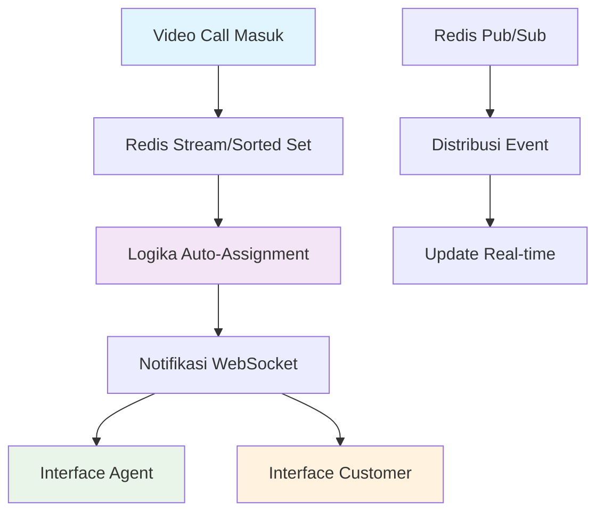

# 🎥 Sistem Auto-Assignment Video Call SMBC
> Optimasi real-time sistem distribusi video call untuk layanan perbankan yang lebih baik

---

## 🎯 Gambaran Proyek

**Durasi:** Mei 2025 - Juli 2025  
**Peran:** Fullstack Engineer  
**Perusahaan:** SMBC Indonesia (Sumitomo Mitsui Banking Corporation Indonesia)

Sebagai bagian dari transformasi digital SMBC Indonesia, saya berkontribusi dalam pengembangan dan optimasi **sistem auto-assignment untuk layanan video call** yang digunakan di berbagai channel, termasuk layanan premium **Sinaya Prioritas**.

Proyek ini bertujuan meningkatkan kecepatan, akurasi, dan efisiensi penugasan video call antara nasabah dan agent menggunakan arsitektur real-time berbasis Redis dan teknologi WebSocket.

---

## 🚀 Tantangan yang Dihadapi

<strong>Bottleneck Sistem & Pain Points</strong>

Sebelum optimasi, sistem auto-assignment menghadapi kendala serius:

- **Polling API Sederhana:** Mekanisme lama menggunakan polling API berulang dari sisi agent untuk mendapatkan antrian video call masuk
- **First Come First Serve:** Video call dialokasikan ke agent berdasarkan siapa yang paling cepat melakukan polling, bukan berdasarkan aturan bisnis
- **Tidak Efisien:** Model polling menimbulkan beban server tinggi dan latensi yang tidak perlu
- **Kurang Adaptif:** Belum ada pengaturan prioritas, baik dari sisi agent maupun nasabah

---

## 💡 Arsitektur Solusi

Saya mengimplementasikan mekanisme auto-assignment baru yang **real-time, efisien, dan berbasis prioritas**.

### Fase 1: Redis Stream + WebSocket
- Video call masuk langsung di-push ke **Redis Stream**
- Agent yang sudah terdaftar menerima notifikasi otomatis real-time via **WebSocket**
- Menghilangkan kebutuhan polling API

### Fase 2: Redis Sorted Set + Hash + Pub/Sub
- Migrasi ke **Redis Sorted Set** dan **Hash** untuk kebutuhan prioritas berbeda
- Skor Sorted Set merepresentasikan prioritas panggilan untuk assignment yang adil sesuai aturan bisnis
- **Redis Pub/Sub** memungkinkan arsitektur event-driven yang responsif
- **WebSocket** tetap digunakan untuk notifikasi frontend real-time

---

## 🛠️ Implementasi Teknis

### Kontribusi Saya sebagai Fullstack Engineer

#### 1. **Implementasi Mekanisme Auto-Assignment**
- Mengeksekusi hasil riset arsitektur Tech Lead menjadi implementasi Redis nyata
- Membangun alur assignment dari Redis Stream hingga migrasi ke Redis Sorted Set & Hash dengan dukungan Pub/Sub

#### 2. **Integrasi Notifikasi Real-Time**
- Menghubungkan Redis Pub/Sub dengan WebSocket untuk distribusi notifikasi real-time
- Memastikan agent dan nasabah menerima update status video call secara instan dan akurat

#### 3. **Optimasi Performa & Skalabilitas**
- Mengurangi beban server dengan menghapus polling API
- Merancang arsitektur berbasis event untuk skalabilitas masa depan

---

## 📊 Hasil & Dampak

| Metrik | Sebelum Optimasi | Sesudah Optimasi |
|--------|------------------|------------------|
| **Metode Assignment** | Polling API sederhana | **Event-driven Auto-assignment** |
| **Efisiensi Server** | Tinggi beban akibat polling | **Ringan & Real-time** |
| **Distribusi Call** | Tidak adil, tergantung polling cepat | **Berbasis Prioritas & Aturan Bisnis** |
| **Pengalaman User** | Delay & tidak konsisten | **Responsif & Transparan** |

## 🔧 Technology Stack

> Karena bersifat internal dan terkait regulasi, detail lengkap tech stack tidak dapat dipublikasikan. Namun teknologi yang digunakan meliputi:

- **Redis (Stream, Sorted Set, Hash, Pub/Sub)**
- **WebSocket** untuk komunikasi real-time
- **Java Spring** untuk layanan backend
- **Next.js** untuk aplikasi frontend
- **Framework tambahan** (Internal, spesifik proyek)

---

## 🎉 Pencapaian Utama

✅ **Menghilangkan API Polling** - Mengurangi beban server secara signifikan  
✅ **Assignment Real-time** - Distribusi video call instan  
✅ **Logika Berbasis Prioritas** - Assignment adil mengikuti aturan bisnis  
✅ **UX yang Enhanced** - Pengalaman agent dan customer yang lebih baik  
✅ **Arsitektur Scalable** - Desain event-driven untuk pertumbuhan masa depan  

---

*Sistem ini berhasil meningkatkan responsivitas layanan video call SMBC Indonesia, terutama pada channel layanan prioritas, mendukung misi bank dalam memberikan pelayanan digital kelas dunia.*
