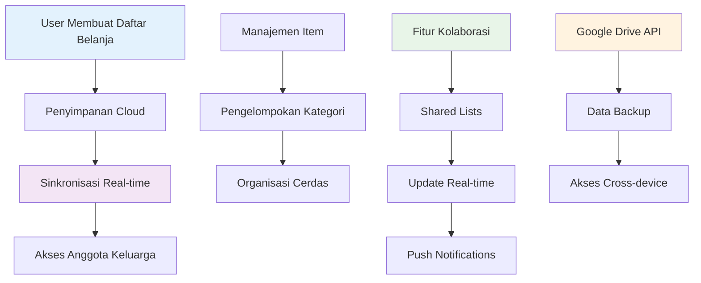
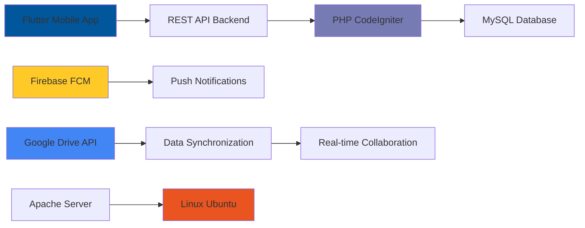

# 🛍️ SMOP Aplikasi Belanja
> Aplikasi daftar belanja cerdas & kolaboratif dengan sinkronisasi real-time

---

## 🎯 Gambaran Proyek

**Durasi:** April 2021 - Juni 2021  
**Peran:** Backend & Deployment Specialist  
**Perusahaan:** PT Togu Inovasi Teknologi

**SMOP (Smart Shopping List)** adalah aplikasi mobile (Android & iOS) yang dikembangkan oleh **PT Togu Inovasi Teknologi** untuk merevolusi cara pengguna merencanakan dan melakukan aktivitas belanja kebutuhan sehari-hari. Aplikasi ini dirancang sebagai solusi cerdas untuk mengatasi masalah umum seperti daftar belanja yang tidak terorganisir, lupa membeli barang, dan kesulitan berkoordinasi dengan anggota keluarga lain.

---

## 🚀 Tantangan yang Dihadapi

<strong>Masalah Proses Belanja Konvensional</strong>

Proses belanja konvensional seringkali tidak efisien dan rentan terhadap kesalahan. Tantangan utamanya adalah:

- **Daftar Konvensional:** Pengguna sering menggunakan catatan kertas atau aplikasi catatan umum yang tidak memiliki fitur khusus untuk belanja
- **Koordinasi yang Sulit:** Sulit untuk berbagi dan menyinkronkan daftar belanja secara *real-time* dengan pasangan atau anggota keluarga, seringkali menyebabkan pembelian ganda atau barang yang terlewat
- **Tidak Terorganisir:** Daftar belanja yang panjang menjadi sulit dibaca dan tidak dikelompokkan berdasarkan kategori produk, membuat proses belanja di toko menjadi lebih lama
- **Risiko Kehilangan Data:** Daftar yang disimpan secara lokal di perangkat berisiko hilang jika perangkat rusak atau hilang

---

## 💡 Solusi: Aplikasi SMOP Smart Shopping

SMOP hadir sebagai solusi inovatif dengan menyediakan platform yang terpusat dan kaya fitur untuk manajemen daftar belanja.

### 🔧 Fitur & Kemampuan Utama

#### **Daftar Belanja Cerdas**
- Pengguna dapat membuat beberapa daftar belanja, mengelompokkan barang berdasarkan kategori, dan menandai barang yang sudah dibeli dengan mudah
- Kategorisasi cerdas untuk organisasi yang lebih baik

#### **Berbagi & Kolaborasi Real-time**
- Fitur andalan SMOP: kemampuan untuk berbagi daftar belanja dengan pengguna lain
- Setiap perubahan (menambah atau menandai barang) akan langsung tersinkronisasi di semua perangkat yang terhubung

#### **Notifikasi Cerdas**
- Sistem notifikasi proaktif yang mengingatkan pengguna tentang daftar belanja aktif atau ketika ada pembaruan dari kolaborator
- Alert dan reminder yang kontekstual

#### **Penyimpanan Cloud**
- Semua daftar belanja disimpan dengan aman di cloud, memungkinkan akses dari perangkat mana pun dan mencegah kehilangan data
- Backup otomatis dan sinkronisasi

#### **Multi-Platform**
- Dibangun menggunakan Flutter, SMOP memberikan pengalaman pengguna yang konsisten dan mulus di platform Android dan iOS
- Single codebase untuk multiple platforms

---

## 🛠️ Kontribusi Teknis Saya

### Backend & Deployment Specialist

Sebagai penanggung jawab utama di sisi server, saya berperan sebagai tulang punggung digital yang memastikan seluruh fitur cerdas dan kolaboratif SMOP dapat berjalan dengan andal dan cepat.

#### 1. **Pengembangan Arsitektur & Penyediaan REST API**
Saya merancang dan membangun seluruh infrastruktur backend menggunakan CodeIgniter 3. Fokus utama saya adalah menyediakan serangkaian REST API yang *robust* dan efisien untuk menangani semua kebutuhan aplikasi mobile, termasuk:
- Manajemen akun pengguna dan autentikasi
- Operasi CRUD (*Create, Read, Update, Delete*) untuk daftar belanja dan item di dalamnya
- Logika bisnis untuk fitur-fitur spesifik aplikasi

#### 2. **Orkestrasi Integrasi Layanan Pihak Ketiga**
Untuk menghidupkan fitur-fitur canggih, saya melakukan integrasi mendalam dengan beberapa layanan eksternal:

**Firebase Cloud Messaging (FCM):** Saya mengimplementasikan integrasi dengan Firebase untuk membangun sistem *push notification*. Ini memungkinkan aplikasi mengirim notifikasi *real-time* kepada pengguna ketika daftar belanja mereka diperbarui oleh kolaborator.

**Google Drive API:** Ini adalah inti dari fitur kolaborasi SMOP. Saya merancang sistem yang memanfaatkan Google Drive untuk menyimpan data daftar belanja. Ini memungkinkan fungsi **berbagi daftar** dengan pengguna lain dan yang terpenting, **sinkronisasi perubahan secara *real-time*** di antara para kolaborator.

#### 3. **Manajemen Server & Deployment**
Saya bertanggung jawab penuh atas deployment dan pemeliharaan lingkungan produksi. Ini mencakup konfigurasi server Linux Ubuntu, optimasi Apache Web Server dan PHP 7, serta pengelolaan database MySQL untuk memastikan ketersediaan dan performa aplikasi yang tinggi bagi semua pengguna.

---

## 📊 Arsitektur Teknis

## 📊 Hasil & Dampak

Aplikasi SMOP berhasil diluncurkan dan mendapat sambutan positif dari pengguna yang mencari solusi praktis untuk manajemen belanja. Proyek ini secara signifikan:

| Fitur | Sebelum SMOP | Sesudah SMOP |
|-------|-------------|-------------|
| **Koordinasi** | Sulit kolaborasi keluarga | **Mudah kolaborasi untuk keluarga dan teman serumah** |
| **Efisiensi** | Waktu terbuang di toko | **Mengurangi waktu di toko dengan list terorganisir** |
| **Pengurangan Error** | Risiko barang tertinggal atau ganda | **Meminimalisir barang tertinggal dan pembelian ganda** |
| **Keamanan Data** | Risiko kehilangan list kertas | **Cloud backup dan sinkronisasi** |

---

## 🔧 Technology Stack

- **Backend:** PHP 7, CodeIgniter 3
- **Mobile Framework:** Flutter (Android & iOS)
- **Database:** MySQL
- **Layanan Pihak Ketiga:** Firebase Cloud Messaging, Google Drive API
- **Infrastruktur & Web Server:** Linux Ubuntu Server, Apache

---

## 🎉 Pencapaian Utama

✅ **Real-time Collaboration** - Berhasil mengimplementasikan sharing daftar belanja keluarga  
✅ **Cross-platform Solution** - Single Flutter app untuk Android dan iOS  
✅ **Smart Notifications** - Sistem push notification yang context-aware  
✅ **Cloud Integration** - Google Drive API untuk sinkronisasi data seamless  
✅ **Scalable Architecture** - Backend dirancang untuk menangani multiple concurrent users  
✅ **Production Deployment** - Full server setup dan deployment aplikasi  

---

## 💡 Learning Teknis

Proyek ini memberikan pengalaman berharga dalam:
- **Arsitektur Mobile Backend** design dan implementasi
- **Third-party API Integration** dengan Firebase dan Google services
- **Real-time Data Synchronization** challenges dan solusinya
- **Multi-platform Development** considerations dan best practices
- **Cloud Storage Integration** untuk aplikasi kolaboratif

---

## 🔄 Kompleksitas Integrasi

<strong>Detail Integrasi Google Drive API</strong>

**Challenge:** Mengimplementasikan kolaborasi real-time melalui Google Drive
**Solution:** 
- Shopping lists disimpan sebagai structured data di Google Drive
- Real-time synchronization melalui Drive API webhooks
- Conflict resolution untuk simultaneous edits
- Secure sharing mechanisms dengan permission management

**Firebase FCM Integration:**
- Push notification triggers untuk list updates
- User preference management untuk notifications
- Cross-platform notification handling

---

*Proyek ini membuktikan kemampuan saya dalam merancang arsitektur backend yang kompleks dan mengintegrasikan berbagai teknologi untuk menciptakan produk konsumen yang fungsional dan bermanfaat, mendemonstrasikan kelayakan teknis solusi shopping kolaboratif real-time.*
