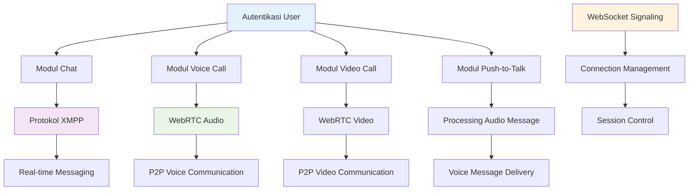
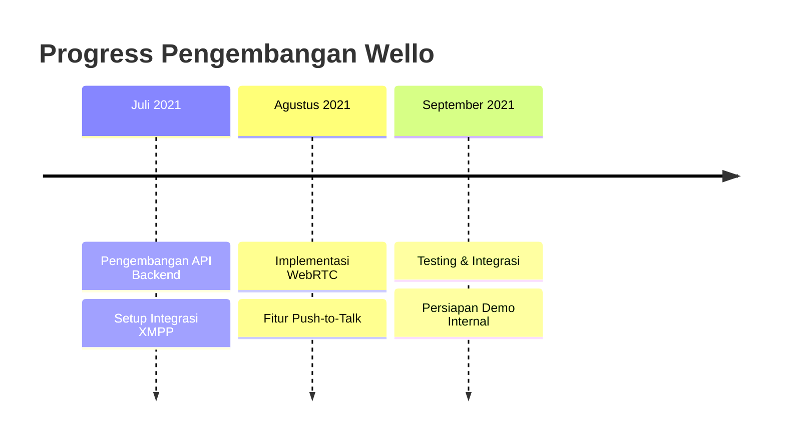

# 💬 Wello Platform Komunikasi
> Aplikasi chat social media real-time dengan fitur komunikasi lanjutan

---

## 🎯 Gambaran Proyek

**Durasi:** Juli 2021 - September 2021  
**Peran:** Backend & Real-Time Communication Engineer  
**Perusahaan:** PT TOGU Inovasi Teknologi

**Wello** adalah aplikasi sosial media yang dikembangkan oleh **PT TOGU Inovasi Teknologi** sebagai bagian dari inisiatif besar *"Hundred Apps Project"*. Aplikasi ini dirancang untuk menghadirkan pengalaman komunikasi modern setara dengan platform populer seperti WhatsApp, Telegram, dan LINE.

Wello mengintegrasikan berbagai fitur komunikasi real-time, mulai dari **chat pribadi**, **group chat**, **voice call**, **video call**, hingga fitur unik **push-to-talk (walkie-talkie)**. Proyek ini menjadi salah satu tonggak awal dalam perjalanan karier saya, di mana saya berperan membangun fondasi backend dan integrasi komunikasi real-time.

---

## 🚀 Tantangan yang Dihadapi

<strong>Tantangan Teknis Komunikasi Real-Time</strong>

Dalam merancang aplikasi komunikasi real-time, tim menghadapi beberapa tantangan teknis yang cukup kompleks:

- **Komunikasi Real-Time:** Diperlukan protokol yang andal untuk mendukung kebutuhan *low latency* pada chat, voice call, dan video call
- **Integrasi Teknologi Berbeda:** Perlu menggabungkan layanan berbasis **WebRTC** untuk panggilan suara dan video, serta **XMPP** untuk chat agar berfungsi secara terpadu
- **Skalabilitas Awal:** Sistem harus mampu menangani ratusan hingga ribuan pengguna secara bersamaan, meski masih dalam tahap awal pengembangan
- **Keterbatasan Waktu:** Proyek ini berjalan paralel dengan aplikasi lain di bawah inisiatif *Hundred Apps*, sehingga pengembangan harus dilakukan secara efisien

---

## 💡 Solusi: Platform Komunikasi Wello

Untuk menjawab tantangan tersebut, saya berkontribusi merancang dan mengimplementasikan **core backend** serta integrasi **real-time communication** pada aplikasi Wello.

### 🔧 Fitur & Kemampuan Utama

#### **Chat & Group Chat**
- Pesan instan dengan **XMPP** sebagai protokol komunikasi
- Dukungan untuk percakapan individual dan grup
- Riwayat pesan dan pelacakan status

#### **Voice Call & Video Call**
- Dibangun dengan **WebRTC** untuk komunikasi suara dan video yang lancar
- Koneksi peer-to-peer untuk performa optimal
- Optimasi kualitas panggilan dan adaptasi jaringan

#### **Push-to-Talk (Walkie-Talkie)**
- Fitur unik yang memungkinkan pengiriman pesan suara singkat dengan cepat
- Sistem pengiriman voice message instan
- Dioptimalkan untuk pola penggunaan mobile

#### **Integrasi Backend-Frontend**
- Backend menyediakan REST API dan WebSocket untuk sinkronisasi data antara server dan aplikasi Android
- Real-time event handling dan state management

---

## 🛠️ Kontribusi Teknis Saya

### Backend & Real-Time Communication Engineer

Pada proyek Wello, saya memegang tanggung jawab utama di sisi backend, mulai dari riset dan desain hingga implementasi teknis:

#### 1. **Research & Desain Sistem**
- Melakukan riset teknologi untuk komunikasi real-time: **XMPP**, **WebRTC**, dan **WebSocket**
- Merancang database dan arsitektur sistem agar dapat mengakomodasi fitur chat, call, dan grup

#### 2. **Implementasi Backend & Integrasi**
- Membangun **REST API** untuk autentikasi, manajemen pengguna, serta alur komunikasi dasar
- Mengintegrasikan **XMPP** untuk fitur chat dan group chat
- Menyediakan **WebSocket signaling server** untuk mendukung **WebRTC** (voice & video call)
- Mengembangkan alur khusus untuk fitur **push-to-talk**

#### 3. **Deployment & Maintenance**
- Menangani deployment awal di server internal perusahaan
- Melakukan monitoring serta perbaikan bug selama fase pengembangan internal

---

## 📊 Arsitektur Teknis

```mermaid
graph LR
    A[Android Native App] --> B[REST API]
    B --> C[PHP CodeIgniter Backend]
    C --> D[MySQL Database]
    
    E[XMPP Server] --> F[Chat Protocol]
    G[WebRTC] --> H[Voice/Video Calls]
    I[WebSocket] --> J[Signaling Server]
    
    K[Push-to-Talk] --> L[Voice Processing]
    
    style A fill:#A4C639
    style C fill:#777BB4
    style E fill:#0052CC
    style G fill:#333333
    style I fill:#4F4F4F
```

## 📊 Hasil Proyek & Timeline Pengembangan

Meskipun proyek ini belum sempat mencapai tahap **release production** karena saya memutuskan melanjutkan karier di perusahaan lain, kontribusi saya telah meletakkan fondasi penting bagi Wello:

| Aspek | Sebelum Wello | Setelah Implementasi Wello |
|-------|-------------|---------------------------|
| **Komunikasi** | Hanya manual via aplikasi chat lain | **Tersedia platform internal dengan chat, group, voice & video call** |
| **Teknologi Real-Time** | Belum ada | **WebRTC & XMPP berhasil diintegrasikan** |
| **Fitur Unik** | Tidak ada | **Push-to-Talk (Walkie-Talkie) tersedia** |

---

## 🔧 Technology Stack

- **Backend:** PHP 7.x (CodeIgniter 3)
- **Database:** MySQL
- **Chat Protocol:** XMPP
- **Voice & Video Call:** WebRTC
- **Signaling:** WebSocket
- **Frontend (Mobile):** Java Android Native

---

## 🎉 Pencapaian Utama

✅ **Real-Time Communication Stack** - Berhasil mengintegrasikan XMPP dan WebRTC  
✅ **Pengembangan Fitur Unik** - Mengimplementasikan fungsi push-to-talk walkie-talkie  
✅ **Multi-Protocol Integration** - Menggabungkan berbagai protokol komunikasi secara seamless  
✅ **Signaling Server** - Membangun signaling berbasis WebSocket untuk koneksi WebRTC  
✅ **Backend Scalable** - Merancang arsitektur API untuk multiple mode komunikasi  
✅ **Penetapan Fondasi** - Menciptakan base yang robust untuk fitur komunikasi masa depan  

---

## 💡 Insights Teknis

Proyek ini memberikan pengalaman berharga dalam:
- **Real-Time Communication (RTC)** technology dan implementasinya
- **Multi-Protocol Integration** challenges dan solusinya
- **WebRTC Signaling** server design dan development
- **XMPP Protocol** untuk sistem instant messaging
- **Mobile Backend APIs** untuk aplikasi komunikasi

---

## 🔬 Technical Deep Dive

<strong>Detail Integrasi WebRTC & XMPP</strong>

**Implementasi WebRTC:**
- Peer-to-peer connection establishment
- ICE candidate exchange via WebSocket signaling
- Media stream management untuk audio/video
- Network adaptation dan quality optimization

**Integrasi XMPP:**
- Real-time messaging protocol implementation
- Presence dan status management
- Group chat room functionality
- Message delivery dan receipt confirmation

**Arsitektur Push-to-Talk:**
- Voice recording dan compression
- Real-time audio message delivery
- Integrasi dengan infrastruktur chat yang ada

---

*Proyek ini menjadi salah satu pengalaman berharga saya dalam menguasai **real-time communication** (RTC), arsitektur backend berbasis API, serta integrasi multi-protokol untuk aplikasi komunikasi modern, memberikan fondasi yang kuat untuk pengembangan sistem komunikasi masa depan.*
