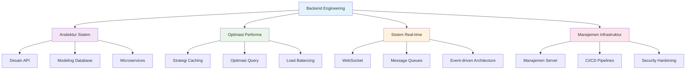

# 🛠️ **Keahlian Teknis Terdepan & Siap Pasar**
> *Skill production-ready yang selaras dengan kebutuhan pasar 2025*

<div align="center">


### **🔥 Analisis Permintaan Pasar**

| Kategori Skill | Permintaan Pasar | Dampak Gaji | Profisiensi Saya |
|----------------|------------------|-------------|-------------------|
| **Sistem Real-time** | 🔥🔥🔥🔥🔥 Sangat Tinggi | +25-40% | ⭐⭐⭐⭐⭐ Expert |
| **Performance Engineering** | 🔥🔥🔥🔥 Tinggi | +20-35% | ⭐⭐⭐⭐⭐ Expert |
| **Event-driven Architecture** | 🔥🔥🔥🔥🔥 Sangat Tinggi | +30-45% | ⭐⭐⭐⭐⭐ Expert |
| **Microservices** | 🔥🔥🔥🔥 Tinggi | +20-30% | ⭐⭐⭐⭐ Advanced |
| **Elasticsearch** | 🔥🔥🔥 Menengah-Tinggi | +15-25% | ⭐⭐⭐⭐⭐ Expert |

</div>

---

## 🎯 Gambaran Kompetensi Inti



---

## 💻 Bahasa Pemrograman

### **Level Expert**


**PHP** `████████████████████████████████████████` **95%**
- 5+ tahun pengembangan profesional
- Expertise Laravel, CodeIgniter
- Fitur modern PHP 7.x/8.x
- Manajemen package Composer

**Python** `██████████████████████████████████████` **90%**
- Penguasaan framework Django
- Library data processing (gensim, fuzzywuzzy)
- Implementasi algoritma
- Optimasi similarity search

### **Level Proficient**


**JavaScript** `██████████████████████████████` **75%**
- Pengembangan backend Node.js
- Implementasi WebSocket
- Dukungan integrasi frontend

**SQL** `████████████████████████████████████████` **95%**
- Optimasi query kompleks
- Desain dan modeling database
- Performance tuning

---

## 🏗️ Framework & Library

### **Web Framework**


**Laravel** `████████████████████████████████████████` **95%**
- Penguasaan Eloquent ORM
- Artisan commands
- Queue jobs & scheduling
- Pengembangan API resource

**Django** `████████████████████████████████████████` **95%**
- Django REST Framework
- Optimasi ORM
- Background task processing
- Pengembangan custom middleware

**CodeIgniter** `██████████████████████████████████` **85%**
- Arsitektur MVC
- Pengembangan custom library
- Implementasi REST API

### **Library Spesialis**
```
🔍 Search & ML Libraries:
├── Elasticsearch-DSL           ████████████████████████████████████████ 95%
├── gensim (NLP)                ██████████████████████████████████ 80%
├── fuzzywuzzy (Fuzzy matching) ████████████████████████████████████████ 95%
└── spellchecker                ██████████████████████████████████ 80%

🔄 Real-time & Communication:
├── WebSocket                   ████████████████████████████████████████ 95%
├── XMPP                        ██████████████████████████████ 70%
├── WebRTC                      ███████████████████████████ 65%
└── Socket.IO                   ██████████████████████████████████ 80%
```

---

## 🗄️ Teknologi Database

### **Database Primer**


**MySQL** `████████████████████████████████████████` **95%**
- Optimasi query lanjutan
- Desain strategi index
- Replikasi & clustering
- Monitoring performa

**Redis** `████████████████████████████████████████` **95%**
- Strategi caching
- Manajemen queue (Pub/Sub)
- Optimasi struktur data
- Manajemen memory

### **Search & Analytics**


**Elasticsearch** `██████████████████████████████████` **85%**
- Desain index & mapping
- Penguasaan Query DSL
- Aggregation pipelines
- Optimasi performa

### **Breakdown Expertise Database**
<details>
<summary><strong>Fitur Lanjutan MySQL</strong></summary>

- **Optimasi Query**: Analisis EXPLAIN, optimasi index
- **Desain Schema**: Strategi normalisasi, denormalisasi
- **Performance Tuning**: Optimasi konfigurasi, analisis slow query
- **Replikasi**: Setup master-slave, strategi failover
- **Backup & Recovery**: Strategi backup otomatis, point-in-time recovery

</details>

<details>
<summary><strong>Spesialisasi Redis</strong></summary>

- **Struktur Data**: Strings, Hashes, Lists, Sets, Sorted Sets
- **Fitur Lanjutan**: Pub/Sub messaging, Lua scripting
- **Optimasi Memory**: Analisis penggunaan memory, eviction policies
- **Persistence**: RDB snapshots, AOF logging
- **Clustering**: Setup dan manajemen Redis Cluster

</details>

---

## ⚡ Performa & Optimasi

### **Strategi Caching**
```
🚀 Expertise Caching:
├── Application-level caching   ████████████████████████████████████████ 95%
├── Database query caching      ████████████████████████████████████████ 95%
├── Redis caching patterns      ████████████████████████████████████████ 95%
├── CDN integration             ██████████████████████████████ 70%
└── Memory optimization         ██████████████████████████████████ 80%
```

### **Optimasi Search**
```
🔍 Teknologi Search:
├── Elasticsearch optimization  ██████████████████████████████████ 85%
├── Full-text search            ████████████████████████████████████████ 95%
├── Similarity algorithms       ████████████████████████████████████████ 95%
├── Fuzzy matching              ████████████████████████████████████████ 95%
└── Search relevance tuning     ██████████████████████████████████ 85%
```

### **Pencapaian Performa Utama**
- ⚡ **87% peningkatan** waktu respon search (15s → <2s)
- 🚀 **70% pengurangan** waktu pemrosesan layanan
- 📈 **500% peningkatan** kapasitas sistem
- 🔄 **Processing real-time** dengan response time sub-detik

---

## 🔄 Background Processing & Queue


### **Sistem Message Queue**
**RabbitMQ** `██████████████████████████████████` **85%**
- Pola desain queue
- Message routing
- Dead letter queues
- Manajemen cluster

**Redis Queue** `████████████████████████████████████████` **95%**
- Implementasi job queue
- Priority queues
- Failed job handling
- Background task processing

### **Pattern Background Processing**
```
📋 Processing Patterns:
├── Asynchronous task processing    ████████████████████████████████████████ 95%
├── Batch processing                ██████████████████████████████████ 80%
├── Scheduled jobs                  ████████████████████████████████████████ 95%
├── Event-driven processing         ████████████████████████████████████████ 95%
└── Pipeline processing             ██████████████████████████████████ 80%
```

---

## 🌐 Infrastruktur & DevOps

### **Administrasi Server**


**Administrasi Linux** `████████████████████████████████████████` **95%**
- Manajemen Ubuntu Server
- Security hardening
- Konfigurasi service
- Manajemen log

### **Web Server**


**Apache** `████████████████████████████████████████` **95%**
- Konfigurasi virtual host
- Performance tuning
- Setup SSL/TLS
- Manajemen module

**Nginx** `██████████████████████████████████` **85%**
- Setup reverse proxy
- Load balancing
- Static file serving

### **Breakdown Keahlian Infrastruktur**
<details>
<summary><strong>Manajemen Server</strong></summary>

- **System Administration**: User management, file permissions, process monitoring
- **Security**: Konfigurasi firewall, fail2ban, SSH hardening
- **Monitoring**: System metrics, analisis log, alerting
- **Backup**: Strategi backup otomatis, disaster recovery
- **Performance**: Optimasi resource, identifikasi bottleneck

</details>

---

## 🔒 Keamanan & Best Practices

### **Implementasi Keamanan**
```
🛡️ Expertise Keamanan:
├── Authentication systems      ████████████████████████████████████████ 95%
├── API security                ████████████████████████████████████████ 95%
├── Data validation             ████████████████████████████████████████ 95%
├── SQL injection prevention    ████████████████████████████████████████ 95%
├── XSS protection              ██████████████████████████████████ 85%
├── CSRF protection             ██████████████████████████████████ 85%
└── Rate limiting               ████████████████████████████████████████ 95%
```

### **Kualitas Kode & Standar**
- **PSR Standards**: PSR-4 autoloading, PSR-12 coding style
- **Design Patterns**: MVC, Repository, Factory, Observer
- **Testing**: Unit testing, Integration testing
- **Documentation**: API documentation, code comments
- **Version Control**: Git workflows, branching strategies

---

## 🔌 Pengembangan & Integrasi API

### **Teknologi API**


**Pengembangan REST API** `████████████████████████████████████████` **95%**
- Prinsip desain RESTful
- HTTP status codes
- API versioning
- Rate limiting

### **Integrasi Third-party**
```
🔗 Pengalaman Integrasi:
├── Firebase (FCM, Auth)        ██████████████████████████████████ 85%
├── Google APIs (Drive, Maps)   ██████████████████████████████████ 85%
├── Payment Gateways            ███████████████████████████ 65%
├── SMS/Email Services          ██████████████████████████████ 75%
└── Social Media APIs           ███████████████████████████ 65%
```

---

## 📊 Domain Spesialis

### **Komunikasi Real-time**
```
💬 Teknologi Komunikasi:
├── WebSocket implementation    ████████████████████████████████████████ 95%
├── WebRTC integration          ███████████████████████████ 65%
├── XMPP protocol               ██████████████████████████████ 70%
├── Push notifications          ██████████████████████████████████ 85%
└── Chat systems                ██████████████████████████████████ 85%
```

### **Search & Information Retrieval**
```
🔍 Spesialisasi Search:
├── Full-text search            ████████████████████████████████████████ 95%
├── Similarity algorithms       ████████████████████████████████████████ 95%
├── Natural language processing ██████████████████████████████ 75%
├── Search relevance tuning     ██████████████████████████████████ 85%
└── Search analytics            ██████████████████████████████ 75%
```

---

## 🎯 Pengalaman Spesifik Industri

### **Financial Technology**
- Integrasi sistem perbankan
- Real-time transaction processing
- Security compliance
- Optimasi performa untuk sistem high-traffic

### **Sistem Pemerintahan**
- Regulatory compliance
- Standar keamanan data
- Digitalisasi layanan publik
- Fitur transparansi dan akuntabilitas

### **E-commerce & Otomotif**
- Optimasi aplikasi high-traffic
- Pengembangan search engine
- Sistem manajemen inventory
- Tools customer service

### **Mobile & Communication**
- Sistem messaging real-time
- Backend API cross-platform
- Sistem push notification
- Integrasi media streaming

---

## 🚀 Continuous Learning & Development

### **Focus Area Saat Ini**
- **Microservices Architecture**: Container orchestration, service mesh
- **Cloud Technologies**: AWS/GCP services, serverless architecture
- **Advanced Caching**: Distributed caching, cache invalidation strategies
- **Machine Learning**: Advanced similarity algorithms, recommendation systems

### **Professional Development**
- **Technical Research**: Mengikuti perkembangan teknologi backend terbaru
- **Open Source**: Berkontribusi pada proyek komunitas
- **Best Practices**: Mengikuti standar dan pola industri
- **Performance Optimization**: Peningkatan sistem berkelanjutan

---

*Kumpulan keahlian komprehensif ini telah dikembangkan melalui 5+ tahun pengalaman hands-on di berbagai proyek dan industri, dengan fokus pada membangun sistem backend yang scalable, efisien, dan maintainable.*
